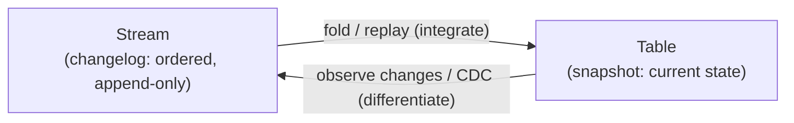

# Stream–Table Duality

> **Tier 0 · Concept 1 of 6**
> The single most important mental model in streaming. Get this right and
> aggregations, joins, and output modes stop being magic.

---

## The one-sentence idea

A **stream** and a **table** are two encodings of the *same information*. You can
convert losslessly in both directions. Neither is more fundamental — that mutual
convertibility is what we mean by **duality**.

---

## Two answers to two different questions

A *table* and a *stream* answer different questions about the same world.

- A **table** answers *"what is true right now?"* — a set of rows keyed by
  identity. It is **current state**. (Analogy: your **position** — where you are
  this instant.)
- A **stream** answers *"what happened, and in what order?"* — an ordered,
  append-only sequence of immutable records, each one a fact stamped with a time.
  (Analogy: your **velocity** — the record of every move that got you here.)

You will often hear "data in motion vs data at rest." That is true but shallow,
and it misleads: it makes a stream sound like *a table that happens to be moving
fast*. The real claim is stronger — they carry the **same information** in two
shapes.

---

## Direction 1 — stream → table (it is a `foldLeft`)

> `foldLeft` is the functional-programming name for
> "walk through a list left to right, carrying a running result, updating it at
> each step." It is exactly how you'd tot up a running total.

Given a changelog (a stream of changes), you rebuild the table by replaying the
records and accumulating. In Scala this is *literally* a left fold:

```scala
val table: Map[String, Int] =
  changelog.foldLeft(Map.empty[String, Int]) { (state, change) =>
    change match
      case Set(key, value) => state + (key -> value)   // upsert / overwrite
      case Delete(key)     => state - key
  }
```

Run this changelog through it:

| time | record       |
|------|--------------|
| t1   | alice = 100  |
| t2   | bob   = 50   |
| t3   | alice = 120  |
| t4   | delete bob   |

…and you get `Map("alice" -> 120)`. **"A table is a snapshot of a stream's
history" is precisely this fold, evaluated at a chosen point in time.** Stop the
fold after `t2` and the snapshot is `Map("alice" -> 100, "bob" -> 50)`.

> The table's value is a **function of how far down the log you have folded.**

This is not a metaphor — it is how database replication actually works. A replica
receives the primary's **write-ahead log** (a stream of changes) and applies it to
materialize a byte-identical table.

> **Write-ahead log (WAL):** a durable, append-only record of every change a
> database is about to make, written *before* the change is applied. We will meet
> it again in Concept 4 — it is the backbone of exactly-once processing.

This inversion — the log is the source of truth, and every table/index/cache is a
*materialized view* over it — is Martin Kleppmann's *"turning the database inside
out,"* the canonical framing for this whole topic.

### A useful Scala refinement: `scanLeft`

`foldLeft` gives only the *final* table. If you want the table's value at **every**
point in time — the whole sequence of snapshots — use `scanLeft`:

```scala
changelog.scanLeft(Map.empty[String, Int])(applyChange)
// = the table after t0, t1, t2, t3, t4 …; the last element is "now".
```

So: the stream is the *input* to the scan; the table-over-time is the *output*;
the last element is the current table. That one line is the whole duality in one
direction.

---

## Direction 2 — table → stream (observe the mutations)

Watch every insert / update / delete applied to a table and emit each one as a
record. Out comes the changelog. This is **Change Data Capture (CDC)** — the
inverse operation.

> **Change Data Capture (CDC):** a technique that taps a database's change feed so
> every row mutation becomes an event on a stream. The canonical
> "operational database → lakehouse in near-real-time" pipeline is built on it.

If `foldLeft` is **integration** (accumulate the changes to recover state), CDC is
**differentiation** (take the state's changes to recover the stream). Integrate
velocity → position; differentiate position → velocity. They are inverses — which
is *why* this is a duality and not merely "two related things."



---

## The distinction that prevents a fuzzy model

There are **two flavors of stream**. Blurring them is the most common source of
confusion here.

**1. Changelog (upsert) stream.** Records directly describe *mutations to a keyed
table*: "key K is now V", "delete K". The fold applies the upsert/delete. CDC
emits these. The `=` means **assignment**, not increment.

**2. Event (fact) stream.** Records are *independent immutable facts*: "alice
clicked at T", "sensor read 21.3°C at T". There is no key being overwritten. The
table you build is whatever **aggregation** you define (`groupBy(user).count()`, a
running sum, …). The fold *is* your aggregation function.

The duality holds for **both** — a table is always *some* fold of *some* stream.
**Only the fold function changes.**

> The deepest consequence: **the table is not a function of the stream alone. It
> is a function of the stream *and* the fold function:**
> `table = stream.foldLeft(empty)(f)`.
> Same records, different `f`, different table.

### One stream, two folds — concretely

Take the stream `widget=5, gadget=3, widget=5, widget=2, delete gadget` and fold
it two ways:

| record       | upsert fold (`set`) | sum fold (`add`) |
|--------------|---------------------|-------------------|
| widget = 5   | {w:5}               | {w:5}             |
| gadget = 3   | {w:5, g:3}          | {w:5, g:3}        |
| widget = 5   | {w:5, g:3}          | {w:10, g:3}       |
| widget = 2   | {w:2, g:3}          | {w:12, g:3}       |
| delete gadget| {w:2}               | {w:12}            |
| **final**    | **widget = 2**      | **widget = 12**   |

Same input, different `f`, different table. The **upsert** column is what a CDC
changelog from a keyed `inventory` table means (apply each mutation, overwrite by
key). The **sum** column is what you get if those records are *events* and you
*chose* a running-sum aggregation.

This is why "a streaming aggregation is stateful" (Tier 2) is no surprise: the
running **state is the table** you are folding the event stream into, and the
**aggregation is `f`.**

---

## A caveat for real CDC: lossless table→stream needs *every* mutation

If you only periodically *diff snapshots* of a table, you recover the **net**
change between snapshots — intermediate history is lost. If three writes happened
between two snapshots, diffing shows only the final delta.

That is exactly why CDC taps the database's actual change feed (every mutation, in
order) rather than sampling state. **Lossless table→stream requires observing
every mutation, not just sampling the table.**

---

## Where this pays off immediately (foreshadow)

Structured Streaming's whole programming model *is* this duality made literal:

- The **input** is modeled as an *unbounded table that grows by appends* — the
  stream→table direction. Your query runs against this conceptually-infinite table.
  (This is Concept 2.)
- The **output modes** (`append` / `update` / `complete`) are the *table→stream*
  direction — three ways to turn the evolving result table back into records:
    - `complete` = re-emit the whole table (a snapshot).
    - `update`   = emit only the rows that changed (the changelog delta).
    - `append`   = emit only newly-finalized rows that will never change again.

So output modes are not arbitrary API surface — they are the duality showing up at
the *output* end, just as the unbounded input table is the duality at the *input*
end.

---

## Spark 3.x → 4.x note

**No gap here.** The unbounded-table model and stream–table duality are identical
in Spark 3.x and 4.x — this is the conceptual bedrock both versions sit on. The
version differences (the `transformWithState` stateful API, RocksDB state-store
internals, the State Data Source reader) live *above* this layer, in Tiers 2 and 4.
Learn this once; it is durable.

---

## Prove you got it

1. **Both directions.** Changelog for an `inventory` table:
   `t1: widget=5 · t2: gadget=3 · t3: widget=5 · t4: widget=2 · t5: delete gadget`.
   (a) Table after folding all five? (b) After only `t3`? (c) Given just the
   snapshot-after-`t3` and snapshot-after-`t4`, can you recover the one record
   between them, and what is it?
2. **Why "duality"?** In one or two sentences: what makes the stream↔table
   relationship a genuine *duality* rather than the shallow "motion vs rest"
   framing? (Hint: what are `foldLeft` and CDC to each other?)

<details>
<summary>Answers</summary>

1. (a) `{widget: 2}` — `widget=2` overwrote the earlier 5s; `delete gadget`
   removed gadget. (b) `{widget: 5, gadget: 3}` — setting `widget=5` twice is
   idempotent. (c) Yes — the single record is the upsert `widget = 2`. Recovery is
   unique here *only because exactly one mutation* sat between the two snapshots.
2. They are **inverse operations** (`foldLeft` ↔ CDC, like integrate ↔
   differentiate). That mutual-inverse property guarantees a lossless round-trip
   and means neither representation is privileged. "Motion vs rest" has no
   inverse-pair in it, so it explains nothing.

</details>

---

[← Tier 0 index](./README.md) · [Next: Unbounded vs Bounded Data →](./02-unbounded-vs-bounded-data.md)
