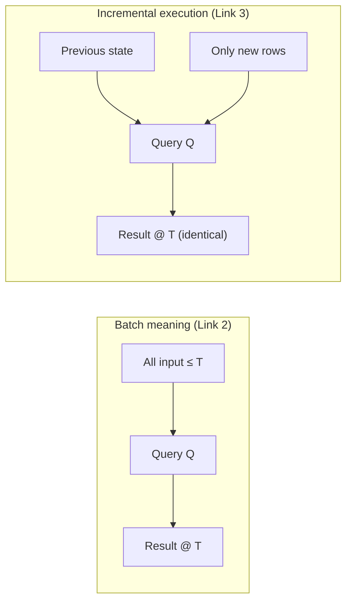

# Unbounded vs Bounded Data — Why Spark Structured Streaming Is "an Incremental Batch Query"

> **Tier 0 · Concept 2 of 6**
> Structured Streaming is the *same* query you'd write on a finite table,
> given **batch meaning** and **incremental execution**. We derive that here —
> we do not just assert it.

---

## The one-sentence idea

**Incremental batch query = batch *semantics* + incremental *execution*.**
The query you write has the meaning of a batch query over all data seen so far;
the engine keeps state and folds in only new data to preserve that meaning cheaply.

---

## Vocabulary first

- **Bounded data:** a finite dataset with a known end — a file, a table snapshot.
  A normal batch job reads it start to finish.
- **Unbounded data:** a dataset with no end — it keeps arriving forever. A stream.
- **State:** information the engine keeps *between* processing steps so it does not
  have to re-read history. (For a running count, the state is the count so far.)

---

## The derivation, one link at a time

**Link 1 — a stream is a growing table (from Concept 1).**
By the duality, an input stream *is* an unbounded table that grows by appends.
Freeze the clock at any instant **T**: everything seen up to T is a *finite,
bounded* table — call it `input≤T`. It is just the fold of all records so far. So
at every moment, a stream hands you an ordinary bounded table.

**Link 2 — the streaming result is defined as a batch result.**
A streaming "query" is some transformation `Q` you would write over a table
(`filter`, `groupBy().agg()`, a join). Nothing about `Q` is stream-specific. So
define the result at instant T as simply:

```
result≤T  =  Q(input≤T)
```

That is the entire **semantic** definition of a Structured Streaming query: the
output at any point equals what a *batch run* of the same `Q` over all
data-seen-so-far would produce, re-evaluated as the input table grows. **Same answer, by definition.** This is what "it
is a batch query" means, made precise.

**Link 3 — where "incrementalized" comes from.**
Taken literally, Link 2 says "re-run `Q` over the entire history every time a
record arrives." Correct, but absurd — cost grows without bound as history
accumulates. So the engine refuses to compute it that way. Instead, it maintains
just enough **state** that when new records arrive it computes the *change* to the
result from `(old state, new records)`, never rescanning history.

And note what that state *is*, by Concept 1: it is a **table**, being folded
forward by the stream of new input. **The incrementalization is the stream→table
fold, running continuously.**



Both lanes produce the **identical** result. Top = meaning(theoretical); bottom = actual execution.

---

## In code: the body of the query is the same

A batch aggregation:

```scala
val result = spark.read.parquet("events")          // bounded table
  .filter($"type" === "click")
  .groupBy($"userId").count()
```

The streaming version — watch what changes:

```scala
val result = spark.readStream.schema(eventSchema).parquet("events")  // unbounded
  .filter($"type" === "click")
  .groupBy($"userId").count()

result.writeStream.outputMode("update").format("console").start()
```

The two transformation lines (`filter`, `groupBy().count()`) are **byte-for-byte
identical.** Only the *ends* change: `read` → `readStream`, and a
`writeStream…start()` replaces the action. (The extra `.schema(...)` is required
because most streaming sources cannot infer a schema from an infinite input — a
Tier-1 detail, not a model change.)

That syntactic identity is not a convenience bolted onto the API — it is the
**direct consequence of Link 2.** You are writing a query over a table; the table
just happens to be unbounded and the answer kept live.

---

## Why this earns its place as a mental model

**1. Reason about correctness with batch intuition.**
Want to know what a streaming query returns? Ask what the *batch* query returns
over the same data. If they could ever disagree, that is a bug in your query or
your mental model — not a quirk of streaming. This is the single most useful
debugging stance in Structured Streaming.

**2. It tells you exactly where the hard parts are.**
Incremental execution (Link 3) only works smoothly when `Q`'s operators can be
maintained from `(state, new data)` without revisiting history. Everything that
"trips people up" is a place where that maintenance needs help:

- an aggregation whose state would otherwise grow forever → **watermarks** (Tier 2)
  to bound it;
- deciding which deltas of the result table are even emittable → **output modes**
  (and now you can see they are just the table→stream direction from Concept 1,
  applied to the *result* table);
- how that state is physically stored when it gets big → **RocksDB state store**
  (Tier 4).

None of those are arbitrary rules. They are all the same question: *can this batch
query be kept up to date incrementally, and with bounded state?*

---

## A first look at "bounded vs unbounded state"

For `groupBy($"country").count()`, the per-key state is one integer — cheap, and
there are only ~200 countries, so total state is tiny and stays so forever.

The thing that can grow without bound is **not** the per-key state — it is the
**number of keys**. Swap the grouping key:

```scala
df.groupBy($"sessionId").count()   // millions of sessions, each kept forever
```

Now you accumulate one integer *per session*, sessions never stop being created,
and — to stay faithful to the batch semantics (Link 2) — the engine must keep
every key's state indefinitely, because a record for any old session *could*
arrive at any future moment. **That** is unbounded state. The danger is
**high-cardinality grouping keys with no license to forget**, not the aggregation
function. Watermarks (Tier 2) supply that license.

---

## Spark 3.x → 4.x note

**No gap at this layer.** "Incrementalized batch query" is the foundational
semantic, identical in 3.x and 4.x — internally the Catalyst engine plans your
batch logical plan as an `IncrementalExecution`, the same way in both. The
4.x-specific features (`transformWithState`, the State Data Source reader,
changelog checkpointing) are *new tools for managing the state in Link 3*; they
sit on top of this model and do not alter it.

> **Catalyst:** Spark SQL's query optimizer/planner — it turns the DataFrame
> operations you write into an optimized execution plan. Same engine for batch and
> streaming.

---

## Prove you got it

You write `df.groupBy($"country").count()` as a streaming query on a Kafka source.

1. **Semantics.** After 1,000,000 records consumed, what does Spark *guarantee* the
   result table equals? State it as a batch run.
2. **Execution.** Record #1,000,001 arrives — one event from `"France"`. What does
   the engine *actually do*, and what does it *not* do?
3. **Forward.** This `count` keeps one integer per country. What makes that cheap
   to maintain incrementally — and sketch a query whose state would grow *without
   bound*.

<details>
<summary>Answers</summary>

1. `result = Q(bounded table of those 1,000,000 records)` — nothing weaker.
2. It reads the current state for key `"France"` (say 9), increments
   (`9 → 10`), writes `France=10` back, and emits that one changed row. It touches
   **one** key; it does **not** rescan the other 999,999 records or the other
   countries' state.
3. Cheap because the new state is computable from `(old state, new record)` with
   fixed, small per-key state (`newCount = oldCount + 1`); countries are bounded
   (~200 keys). Unbounded example: `groupBy($"sessionId").count()` — unbounded key
   cardinality, no watermark, so state grows forever.

</details>

---

[← Previous: Stream–Table Duality](./01-stream-table-duality.md) · [Tier 0 index](./README.md) · [Next: The Clocks →](./03-the-clocks.md)
