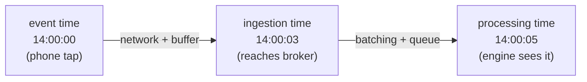

# The Clocks — Event Time vs Processing Time vs Ingestion Time

> **Tier 0 · Concept 3 of 6**
> Almost every hard problem in streaming is a disagreement between clocks.
> We derive *why* they must differ before naming them.

---

## The one-sentence idea

**Event time** (when it happened) and **processing time** (when the system saw it)
cannot be equal in general, because information cannot travel and be processed in
zero time. The gap between them — **skew** — is *variable per record*, which is
what makes it a real engineering problem rather than bookkeeping.

---

## Why there is more than one clock at all

Follow one event's life. A user taps "buy" at **14:00:00**. That tap is a fact, and
the fact has a time baked into it — the moment it happened. Call it **event
time**. It is a property of the event, frozen the instant it occurred; it never
changes afterward.

But the event does not teleport into your cluster. On a flaky connection it sits in
a buffer, reaches the message broker at **14:00:03**, and your engine's micro-batch
finally *sees* it at **14:00:05**. The moment the engine processes it is
**processing time** — a property of *your machine's wall clock*, not of the event.

> **A law, not a quirk:** event time and processing time cannot be equal in
> general, because there is always a delay — network, buffering, batching, retries
> — between *when something happened* and *when you found out*. That delay is
> variable and not under your control.

The two clocks are forced by physics: the producer's clock (when it happened) and
the consumer's clock (when we processed it) are different clocks in different
places, and the gap — **skew** — wobbles unpredictably.

The third clock, **ingestion time**, is a compromise: the time the record *entered
the system* (e.g. the timestamp the broker stamps on arrival). It sits between the
other two — later than event time, earlier than processing time — and is a fallback
for when the event itself carries no trustworthy timestamp.



The span from event time to processing time is the **skew** (here 5s) — and it is
different for every record.

---

## The consequence that makes this matter: out-of-order arrival

If skew were *constant*, the clocks would differ by a fixed offset you could
subtract away, and the distinction would not matter. The reason the clocks are a
real problem is that skew is **variable per record**:

> **Records do not arrive in event-time order.**

Two taps happen at 14:00:00 and 14:00:01. The first is on bad signal and arrives at
14:00:09; the second is on wifi and arrives at 14:00:02. The engine sees the
*later* event first. At scale this is constant — mobile clients, retries, partition
rebalances, and backfills all reorder events relative to when they happened.

Now connect it to Concept 2. Your query's correctness is defined by the
batch-equivalent answer. If the question is "how many purchases happened in the
14:00–14:01 minute?", the correct answer is defined by **event time** — it is about
when purchases *happened in the world*. But the data arrives in *processing-time*
order. So at 14:00:05 the engine has seen some of that minute's events but maybe not
all (a straggler is still in flight). When is it safe to declare the minute "done"?

That single question — *"when have I seen enough to finalize an event-time window,
given that stragglers may still arrive?"* — is what **watermarks** answer (Tier 2).
A watermark is an *estimate of how far the event-time clock has progressed*,
inferred from the data, plus a tolerance for how late a straggler can be before we
stop waiting. It is the bridge that lets a processing-time engine produce
event-time-correct answers.

> **Tier-2 hook (noted for later):** the watermark mechanism — roughly
> `watermark = max event-time seen so far − tolerance`, how it advances each
> micro-batch, late-data dropping, and the watermark/output-mode interaction — is
> dissected properly in Tier 2. Here we only need to know *why* it must exist.

---

## Monotonicity — which clock is safe to compute against

For a *given* record, the timestamps occur in this order:

```
event time  ≤  ingestion time  ≤  processing time
```

- **Event time** is freely **out of order** across records (the whole problem
  above).
- **Processing time** is **monotonic non-decreasing by construction** — it is the
  wall clock at the moment of processing, and wall clocks only move forward.
  Whatever you process *next* gets a stamp ≥ the previous one, because "next" means
  "later on my clock." It *cannot* be out of order, because the act of processing
  defines the order.
- **Ingestion time** is *usually* monotonic but **not guaranteed** — it depends on
  the source (across broker partitions or under clock skew it can wobble).

> The clean, always-true statement: **event time — freely out of order; processing
> time — always monotonic; ingestion time — monotonic-ish, source-dependent.**

The deep point: the property that makes a clock *safe to compute against*
(monotonicity) is the same property that makes it *blind to the world*. Processing
time is monotonic precisely because it only knows "when I got to it," which
reorders reality. Event time can answer world-questions precisely because it is
out of order. **That is the tension you fight in every event-time computation.**

---

## Which clock should you key your logic on?

Almost always **event time**, because it is the only clock that gives *correct,
reproducible* answers.

> **The decisive property:** replay the same data tomorrow — same records, same
> event-time stamps — and any event-time computation gives the **identical**
> result, because event time is baked into the records. A *processing-time*
> computation gives a *different* answer every run, because "when the engine saw
> it" depends on today's network, load, and trigger timing. Processing-time results
> are not reproducible → not testable → not backfillable.

In Structured Streaming, choosing event time is just naming the column that carries
it:

```scala
events
  .withWatermark("eventTime", "10 minutes")          // event-time col + tolerance
  .groupBy(window($"eventTime", "1 minute"), $"country")
  .count()
```

`window($"eventTime", ...)` groups by the time *baked into the record*. Contrast
processing-time windowing, which keys on arrival:

```scala
events
  .groupBy(window(current_timestamp(), "1 minute"))   // groups by when seen
  .count()
```

The second needs no watermark and never waits for stragglers — because it is not
trying to be correct about *when things happened*, only about *what was processed
in this wall-clock minute*. That is legitimately what you want in a narrow set of
cases: **pure operational monitoring** (events-ingested-per-minute, throughput/lag
dashboards) where the question genuinely *is* about your system. For anything about
the domain — revenue, behavior, SLAs measured against when events occurred —
event time is the correct and only reproducible choice.

---

## Spark 3.x → 4.x note

**No semantic gap in the clock model** — event/processing/ingestion time and
watermarking work the same way in 3.x and 4.x. One 4.x-relevant sharpening: the
modern `transformWithState` API (Spark 4.0) exposes **both event-time and
processing-time timers** as first-class callbacks in your stateful processor — "fire
this callback when *event time* passes T" vs "…when *processing time* passes T." So
the two-clock distinction becomes something you program against directly. The older
`mapGroupsWithState` had a coarser version (`GroupStateTimeout`); the 4.x upgrade is
precisely cleaner separation of the two clocks.

---

## Prove you got it

1. **Forced difference.** Why can't event time and processing time be made equal by
   configuring the engine or buying better hardware? What would have to be true of
   the universe for them to coincide?
2. **Order & monotonicity.** Put the three timestamps in order for one record, and
   say which is monotonic and which can be out of order across records — and why.
3. **Pick the clock** (event or processing, one-line why):
   (a) total sales per calendar hour for finance;
   (b) records ingested per second for an on-call dashboard;
   (c) sessionize each user's clicks into bursts separated by 30-min gaps.

<details>
<summary>Answers</summary>

1. The delay is physical (network, buffering, retries); better hardware shrinks but
   never eliminates it, and it is **variable per record**, so no fixed offset can
   normalize it away. They coincide only in a universe with zero latency. (A
   *constant* delay would not make them equal, but would make them trivially
   convertible — it is the *variance* that bites.)
2. `event ≤ ingestion ≤ processing`. **Processing time** is monotonic (wall clock,
   moves only forward; processing order defines it). **Event time** can be out of
   order (baked in at the source; arrival reorders it). Ingestion is usually
   monotonic but source-dependent.
3. (a) event — a world question, must be reproducible/backfillable; (b) processing
   — a question about the system's throughput, not the world; (c) event — gaps
   between when clicks *occurred*; arrival order would shatter sessions. *(Note:
   (c) is a session window — dynamic-gap — revisited in Tier 2.)*

</details>

---

[← Previous: Unbounded vs Bounded Data](./02-unbounded-vs-bounded-data.md) · [Tier 0 index](./README.md) · [Next: Delivery Semantics →](./04-delivery-semantics.md)
