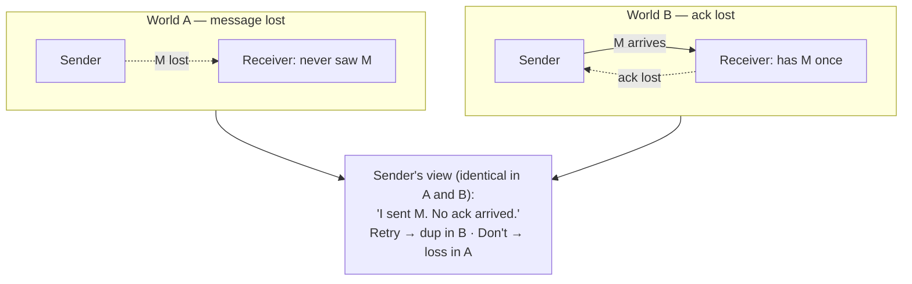
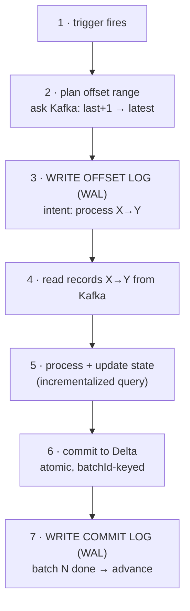

# Delivery Semantics — and Why "Exactly-Once" Is Both Impossible and Routine

> **Tier 0 · Concept 4 of 6**
> Exactly-once *delivery* is impossible; exactly-once *effect* is routine. This
> sounds like a contradiction until you derive it. So we derive it — then wire it
> into a real Kafka → Delta pipeline.

---

## The one-sentence idea

You cannot guarantee a message is *delivered* exactly once over an unreliable
channel. But you can make duplicate delivery **not matter** — by combining a
**replayable source** with an **idempotent/transactional sink** — so the
*observable effect* is as if each message were processed exactly once.

---

## Vocabulary first

- **Idempotent:** an operation whose repetition has the same effect as doing it
  once. `SET x = 5` is idempotent; `x = x + 5` is not. Pressing a lift button is
  idempotent; adding an item to a cart is not. Adding same element to a Set again and again is idempotent; adding a same element to a List is not.
- **Replayable source:** a source you can re-read from a known position after a
  crash (Kafka, via offsets). A plain socket is *not* replayable — once a byte is
  read and lost, it is gone.
- **Idempotent / transactional sink:** an output that absorbs duplicate writes
  without double-counting — via upsert-by-key, or via writing and recording
  progress in one atomic transaction.

---

## The three delivery semantics

Two parties, a **sender** and a **receiver**, over an **unreliable channel**
(messages can be lost, delayed, duplicated). The only feedback is an
**acknowledgement (ack)** sent *back over the same unreliable channel*. Hold that
clause — it is the whole ballgame.

- **At-most-once:** send, never retry. Missing ack → shrug. Messages can be *lost*,
  never duplicated. "Fire and forget."
- **At-least-once:** send, retry until acked. Never lost (≥1 delivery), but can be
  *duplicated* (if the message arrived and only the *ack* was lost, the retry
  delivers a second copy).
- **Exactly-once delivery:** every message processed once and only once. What
  everyone wants — and what is impossible at the delivery layer.

---

## Why exactly-once *delivery* is impossible

The sender transmits M and waits for an ack. The ack does not come. The sender now
faces a question it **cannot** answer:

> Did M get lost on the way *there*, or did M arrive fine and the *ack* got lost on
> the way *back*?

From the sender's vantage point these two worlds are **physically
indistinguishable** — in both, it sent M and saw no ack. Waiting does not resolve
it (the ack might be slow). The payload cannot resolve it (the question is about the
channel). The sender has exactly two options, and **each is wrong in one of the two
worlds**:

- **Retry M.** Correct if M was lost. But if M arrived and only the ack was lost →
  the receiver now has M **twice** (duplication).
- **Don't retry.** Correct if M arrived. But if M was truly lost → M is **never
  delivered** (loss).

There is no third option, and the sender cannot tell which world it is in. So at
the delivery layer you are *forced* to choose your failure mode: risk loss
(at-most-once) or risk duplication (at-least-once). **You cannot have neither.**
This is a logical consequence of the ack sharing the lossy channel — the same shape
as the **Two Generals Problem**.

---

## The escape: fix the *effect*, not the delivery

Accept the impossibility and route around it. Since we cannot avoid duplicate
*delivery*, make duplicate delivery **not matter**. Choose **at-least-once** (never
lose data — always retry), then make the **processing of each message idempotent**,
so duplicates collapse into the same end state.

> **The chain of reasoning:**
> exactly-once *delivery* is impossible → use at-least-once (no loss, allows
> duplicates) → make processing idempotent (duplicates collapse) → the *observable
> effect* is as if each message were processed exactly once = **exactly-once
> effect** (a.k.a. "effectively-once").

The impossibility proof rules out exactly-once *delivery over the channel*. It does
**not** rule out exactly-once *effect*, because effect is about the final *state*,
not the count of deliveries.

---

## The two ingredients (this is the Tier-4 backbone)

Exactly-once effect needs **both**, working together. Miss either and it breaks.

**1. A replayable source.** After a crash, the system must re-read the exact records
it was processing, from a known position (Kafka offsets). If the source cannot
replay (a plain socket), you cannot recover without loss — exactly-once is off the
table from the start.

**2. An idempotent or transactional sink.** The output must absorb duplicates:
- **Idempotent:** writing the same record twice is a no-op the second time — an
  upsert keyed by a unique id (`MERGE … ON CONFLICT DO UPDATE`), or a deterministic
  file path that gets overwritten. *(This is the upsert fold from Concept 1 — `SET`,
  not `+=`.)*
- **Transactional:** the write and the progress-record happen in **one atomic
  transaction**, so either both land or neither does. On replay you never see a
  half-written batch (Delta Lake commits; Kafka transactions).

### Why both are needed — traced through a failure

The engine reads records (source), processes them, writes output (sink), then
records "I consumed up to offset N" (the progress log). Suppose it **crashes after
writing output but before recording the offset.** On restart it does not know it
already wrote that batch, so it **replays** from the old offset and writes the *same
output again.*

- Without an idempotent/transactional sink → duplicate rows.
- With one → the re-write collapses (upsert overwrites identically, or the
  transaction makes the partial work invisible).

**The replayable source is what *causes* the duplicate; the idempotent sink is what
*neutralizes* it. Neither alone suffices** — replay-without-idempotency duplicates;
idempotency-without-replay cannot recover lost in-flight data.

> A perfectly idempotent sink **cannot** save data from a non-replayable source.
> Idempotency dedupes what you *do* reprocess; it cannot conjure back data you can
> never re-read.

---

## Idempotent or not? (worked classification)

| sink write | idempotent? | why |
|------------|-------------|-----|
| `INSERT` into a table with an **auto-increment id** | No | each replay inserts a new row with a new id → duplicate |
| `MERGE` upsert keyed on the event's natural `eventId` | Yes | replay matches the existing row, overwrites identically |
| append a line to a path **derived from `batchId`**, restart **overwrites** that path | Yes | same `batchId` → same path → overwrite leaves one copy (this is how Spark's file sink works) |
| `UPDATE accounts SET balance = balance + 100 WHERE id = 7` | No | additive — replay gives +200, +300 … (the classic exactly-once bug) |

> **The test is never the verb.** "Append" *sounds* non-idempotent, but if the
> destination is a deterministic function of a stable key (`batchId`) and the write
> overwrites, the *net effect* is idempotent. Ask: **"does replaying produce the
> same final state, keyed by something stable?"** The discriminator is
> `SET`-by-stable-key (idempotent) vs `+=`/new-key (not).

---

## Putting it together: a Kafka → Delta micro-batch lifecycle

This is exactly-once effect wired into real components. Source = Kafka (replayable).
Sink = Delta Lake (transactional). The whole guarantee comes from a **write-ahead
log discipline**: *record what you intend to do before you do it; record that you
finished only after it is durably done.*

Steps **3** and **7** are the only writes to the checkpoint, and one happens
*before* the work, the other *after*. Everything between is the work.

- **Step 2 — plan.** Ask Kafka: "I last finished at offset X; what is the latest
  available?" → Y. This batch *owns* the half-open range `(X, Y]`, frozen before
  any read. (`maxOffsetsPerTrigger` caps Y so a post-downtime catch-up does not
  swallow a billion records — the backpressure knob, Tier 4.)
- **Step 3 — write the offset log (write-ahead).** *Before reading anything*,
  durably record "batch N will process `(X, Y]`." So that after any later crash,
  recovery knows *exactly* what batch N was supposed to be — the same range,
  deterministically.
- **Step 4 — read.** Read `(X, Y]`. The engine tracks these offsets **in its own
  checkpoint, not via Kafka consumer-group commits** — because exactly-once needs
  offset position and output committed *together*, which only one coordinated log
  can do.
- **Step 5 — process + update state.** The incrementalized batch query (Concept 2)
  runs; the **state store** (versioned per batch) is read and updated for the
  relevant keys.
- **Step 6 — commit to Delta (transactional sink).** The batch's rows land as a
  *single atomic transaction*, tagged with the query id and `batchId`. A reader
  never sees a half-written batch.
- **Step 7 — write the commit log (write-ahead).** *After* the Delta commit
  succeeds, record "batch N complete." Now advance to N+1, starting from Y.

### What's physically in the checkpoint

- **offset log** — one entry per batch: the offset range that batch *intends* to
  process, plus reproducibility metadata (notably the event-time **watermark** at
  batch start). Written at step 3, *ahead* of processing.
- **commit log** — one entry per *completed* batch, written at step 7.
- **state store** — versioned state for any stateful operator, one version per
  batch.
- **query metadata** — the streaming query's stable id, source metadata.

> The offset log records **intent** (written first); the commit log records
> **completion** (written last). A batch with an offset entry but **no** commit
> entry is one that started but may not have finished — and that is exactly the
> batch the engine replays. The Delta `_delta_log` is a *separate* log owned by the
> table; the two are bridged by the **`batchId`**.

### Why the ordering *is* the guarantee — three crash points

- **Crash after step 3, before step 6.** Restart sees batch N in the offset log,
  no commit entry → replays the *same* range `(X, Y]`, commits to Delta. The
  original never committed, so no duplicate. No loss, no duplication.
- **Crash after step 6, before step 7 (the subtle one).** Restart again sees no
  commit entry → replays and *re-commits to Delta*. But Delta already committed
  batch N! The **`batchId` bridge** saves you: Delta remembers the highest
  `batchId` committed for that query and **silently ignores the duplicate commit.**
  Ingredient #2 doing its job.
- **Crash after step 7.** Batch N is durably complete; restart starts N+1 from Y.
  Nothing to redo.

> **The guarantee = WAL ordering + the `batchId` bridge.** The offset log (first)
> guarantees a crashed batch is replayed with an *identical* range. The commit log
> (last) is the single source of truth for "did it finish." The `batchId` lets the
> sink reject a replay it already committed. Replay (Kafka) → no loss; sink dedup
> (Delta) → no duplication. Together: **exactly-once effect.**

### The ordering is a *third* requirement

Replayable source + idempotent sink are **necessary but not sufficient.** The
*ordering* of the bookkeeping is independent:

- **Reverse the order** (commit log first, Delta second): crash between them, and on
  restart the engine sees "batch N done," skips it — but the Delta write never
  happened. **Data lost forever.** Two correct ingredients, still broken.
- **Right order, non-idempotent sink:** crash between step 6 and 7 → replay
  re-writes the rows → **duplication.**

> Exactly-once effect sits at the intersection of **three** things: replayable
> source **and** idempotent sink **and** correct WAL ordering. Drop any one and you
> fall into loss or duplication. The rule the ordering encodes: **never record that
> something is done until it provably is.**

---

## Spark 3.x → 4.x note

The semantics are identical in 3.x and 4.x — exactly-once effect, replay, the WAL
discipline. The 4.x-relevant sharpenings *strengthen ingredient #2*: Delta Lake's
transactional sink makes idempotency nearly free (strongly recommended for the
portfolio project), and `maxOffsetsPerTrigger` matters more once you run for real.
Neither changes the model.

---

## Prove you got it

1. **Impossibility.** Why can the sender never achieve exactly-once *delivery*? Name
   the single fact about the channel that forces the loss-or-duplication choice.
2. **The escape.** We pick at-least-once. How does that become exactly-once
   *effect*, and what does each of the two ingredients *prevent*? What breaks with a
   perfectly idempotent sink but a non-replayable socket source?
3. **Ordering.** If a naïve engine wrote the commit log *first* and committed to the
   sink *second*, describe the crash-between failure — loss or duplication?

Answers

1. The ack shares the same unreliable channel, so "no ack" maps to two
   indistinguishable worlds (message lost vs ack lost); the sender cannot tell
   which, so it must risk loss or duplication.
2. At-least-once never loses data; idempotent processing collapses the duplicates →
   exactly-once effect. Replayable source *prevents loss*; idempotent/transactional
   sink *prevents duplication*. With a socket source, crashed in-flight data is
   gone — no sink idempotency can recover data that was never re-readable.
3. **Loss.** On restart the engine sees "batch N done," skips it, advances — but
   the sink write never happened, so batch N's records are lost forever.

---

[← Previous: The Clocks](./03-the-clocks.md) · [Tier 0 index](./README.md) · [Next: Processing Models →](./05-processing-models.md)
