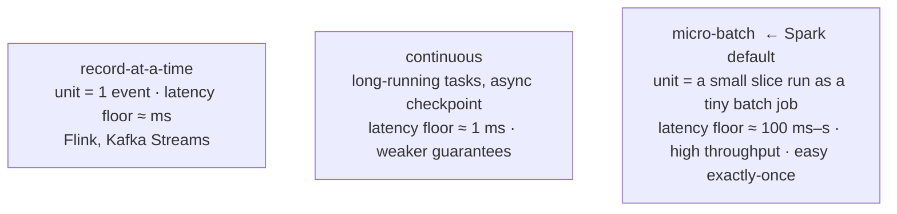

# Processing Models — Micro-Batch vs Continuous vs Record-at-a-Time

> **Tier 0 · Concept 5 of 6**
> Where Spark sits, where the latency floor comes from, and how to pick an engine
> from an SLA — not from tribe.

---

## The one-sentence idea

The whole taxonomy follows from one question: **how much data do you handle per
unit of work?** That choice cascades into latency, throughput, and how hard
exactly-once is. Spark Structured Streaming is a **micro-batch** engine: it trades
a latency floor for high throughput and *structurally simple* exactly-once.

---

## Vocabulary first

- **Latency:** how long after an event arrives before its effect is visible.
- **Throughput:** how many events you can process per unit time.
- **Latency floor:** the *lowest* latency a model can achieve, no matter how you
  tune it — a property of the model, not the hardware.
- **SLA (Service-Level Agreement):** the business promise about latency/freshness
  ("dashboards ≤ 1 minute stale"). The SLA is what picks the engine.

---

## The three models, derived

**Record-at-a-time.** Unit of work = *one event*. A record lands, you process it,
emit, move on. Lowest latency (ms) — nothing waits for anything. Flink and Kafka
Streams are built this way. Cost: *per-record overhead* (every event pays full
scheduling/routing/checkpoint cost), and exactly-once is *harder* — there is no
batch boundary to lean on, so you need finer machinery (Flink uses distributed
snapshots / barriers) to get consistent state across a continuous flow.

**Micro-batch.** Unit of work = *a small group of records collected over a short
interval*, run as a **complete tiny batch job** — the exact seven-step lifecycle
from Concept 4 — then repeated forever. Spark's native, default model.

> **The trade-off, derived:** batching *amortizes* per-record overhead (one
> scheduling decision, one checkpoint write, one commit covers thousands of
> records) → **high throughput**. But it *imposes a latency floor*: a record
> arriving at the *start* of an interval must wait for the rest of the interval to
> fill **and** for the whole batch to process before its effect is visible. You
> cannot get below roughly the batch cycle time. The ~100ms–seconds floor is not
> inefficiency — it is the *definition* of batching.

The flip side, and why micro-batch dominates: exactly-once is *structurally easy*.
Each batch is a discrete unit with a clear boundary, so "did it commit?" is one
yes/no question — the offset-log/commit-log protocol. **The batch boundary is the
transaction boundary.**

**Continuous.** A middle path Spark also offers (`Trigger.Continuous`): long-running
tasks read non-stop and checkpoint *asynchronously*, pushing the floor to ~1ms. The
catch: limited operations and weaker guarantees (historically at-least-once). A
niche tool for genuine sub-10ms needs.

---

## Where Spark sits, and the honest trade-off

> Spark Structured Streaming is **fundamentally a micro-batch engine** (continuous
> is a rarely-used option). It trades a latency floor (~100ms–s) for high
> throughput and *structurally simple* exactly-once. Flink / Kafka Streams are
> record-at-a-time: lower latency floor, more complex consistency machinery.

There is **no universally better model.** The question is always *"what latency
does the business actually need?"*:

- SLA comfortably **above ~1 second** → micro-batch is clearly right (higher
  throughput per dollar, exactly-once nearly free).
- SLA demands consistent **sub-100ms** → you need record-at-a-time.
- The **100ms–1s band** is the genuine judgment zone (weigh throughput,
  exactly-once needs, operational complexity).

Picking Flink for a 1-minute-SLA dashboard is over-engineering; picking Spark
micro-batch for sub-millisecond ad-bidding is under-engineering. **The model
follows the SLA.** This is also why "Spark vs Flink?" in an interview has a
*defensible* answer: name the latency SLA, throughput, and exactly-once needs, and
the model falls out. *(This engine-selection reasoning is a Tier-6 architecture
skill, reachable early by deriving it.)*

---

## The latency floor is Concept 3 in disguise

The micro-batch floor interacts with the clocks: the *processing-time* delay a
record experiences includes "time spent waiting for the current batch to fill and
run." So `Trigger.ProcessingTime("10 seconds")` explicitly sets a floor on
processing-time skew — trading latency for fewer, larger, more efficient batches.
Smaller interval = lower latency, more overhead; larger = higher latency, better
throughput. That knob is you choosing your position on the trade-off curve.

---

## Spark 3.x → 4.x note

The micro-batch model is identical in 3.x and 4.x — bedrock. The experimental
continuous mode has stayed niche and limited in both, so **do not build the
portfolio project on it** — micro-batch is correct for everything in this roadmap.
Low-latency gains in the Spark world have come through micro-batch optimizations
(faster state, async progress tracking — Tier 4), not continuous mode.

---

## Prove you got it

1. **Derive the floor.** Why does micro-batch have a latency floor that
   record-at-a-time does not? Trace a record arriving at the very start of an
   interval — what does it *wait for*?
2. **Exactly-once asymmetry.** Why is exactly-once *structurally easier* in
   micro-batch than record-at-a-time? What natural boundary does a micro-batch give
   you that a continuous flow lacks?
3. **Pick the engine** (Spark micro-batch or Flink record-at-a-time, one-line why,
   anchored to the SLA):
   (a) hourly revenue dashboard, ≤ 2 minutes behind;
   (b) ad-bidding, respond within 10 ms;
   (c) enrich clickstream and land in the lakehouse for next-day analytics.

Answers

1. The record waits for **two** things: the interval to *fill* (waiting for other
   records), then the whole batch to *process and commit* (steps 4–7). Its effect
   is invisible until the batch commits. Record-at-a-time skips both — unit = 1
   record, committed immediately.
2. The **batch boundary is also the transaction boundary** — "which offsets / which
   output / did it commit" share one boundary and one commit-log entry. A continuous
   record-by-record flow has no natural seam, so it must *manufacture* consistent
   cut-points (Flink's barriers).
3. (a) Spark — SLA far above the floor, efficient + simple exactly-once; (b) Flink
   — 10ms is below micro-batch's floor, physically unmeetable with Spark; (c) Spark
   — latency irrelevant, throughput + lakehouse exactly-once win.

---

[← Previous: Delivery Semantics](./04-delivery-semantics.md) · [Tier 0 index](./README.md) · [Next: DStreams (for contrast) →](./06-dstreams-for-contrast.md)
