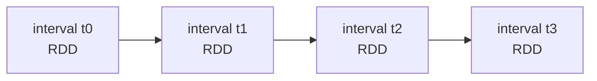

# DStreams — for Contrast Only

> **Tier 0 · Concept 6 of 6**
> Reference material. DStreams are the *legacy* streaming API. We cover them only
> to sharpen, by contrast, what Structured Streaming actually changed. **Do not
> build anything new on DStreams.**

---

## The one-sentence idea

DStreams gave you a **sequence of RDDs, one per time-slice**, and made *you*
hand-wire the incremental logic. Structured Streaming replaced this with **one
logical query over an unbounded table**, planned and incrementalized *for* you by
the Catalyst engine. The shift is from "a stream of batch jobs you assemble" to "a
batch query the engine keeps live."

---

## Vocabulary first

- **RDD (Resilient Distributed Dataset):** Spark's original low-level data
  abstraction — an immutable, partitioned, distributed collection you transform
  with `map` / `filter` / `reduce`. It is *untyped at the schema level* and gets
  **no Catalyst optimization** (you wrote the execution, more or less, by hand).
- **DStream (Discretized Stream):** the old streaming abstraction (Spark Streaming,
  pre-Structured). A DStream is *a continuous series of RDDs*, each RDD holding the
  data for one fixed time interval (a "batch interval").
- **Catalyst / Tungsten:** Spark SQL's optimizer (Catalyst) and its efficient
  in-memory data format and code generation (Tungsten). DataFrames/Datasets get
  both; raw RDDs/DStreams get neither.

---

## How DStreams worked (the mental model)

A DStream chops the incoming stream into fixed time windows — say, one RDD every
1 second — and your job was to express the computation as **operations on each
RDD**:

```scala
// Legacy DStream style — shown for contrast, NOT to use.
val ssc = new StreamingContext(conf, Seconds(1))
val lines: DStream[String] = ssc.socketTextStream("localhost", 9999)

val counts: DStream[(String, Int)] =
  lines.flatMap(_.split(" "))
       .map(word => (word, 1))
       .reduceByKey(_ + _)        // per-interval reduction

counts.print()
ssc.start()
ssc.awaitTermination()
```

Each batch interval produced **one RDD**, the operators ran over that RDD, and the
result was emitted. Stateful logic across intervals (a running count, sessionizing)
was *your* responsibility, via APIs like `updateStateByKey` /
`mapWithState` — you explicitly threaded state from one interval's RDD to the next.



A DStream is literally that row of RDDs, processed one at a time.

---

## What was wrong with it (why it was superseded)

Mapping this against the five concepts you just built makes the gaps obvious:

1. **No first-class event time.** DStreams batched by *arrival* (processing time —
   Concept 3). Event-time windows, watermarks, and correct late-data handling were
   not part of the model. For correctness about *when things happened*, you were
   largely on your own.
2. **No Catalyst/Tungsten optimization.** Operating on raw RDDs meant no query
   optimizer, no columnar Tungsten format, no whole-stage code generation — slower,
   and no automatic plan improvements.
3. **You hand-wired the incrementalization.** Concept 2's "the engine keeps state
   and folds in only new data, *for you*" was *not* true here. State management
   across intervals was manual and error-prone (`updateStateByKey` rescanned all
   keys every interval, for instance).
4. **Weaker, more manual end-to-end guarantees.** Exactly-once effect (Concept 4)
   was achievable but far more hands-on; the clean offset-log/commit-log +
   transactional-sink story is a Structured Streaming contribution.
5. **A separate programming model.** DStream code looked nothing like your batch
   DataFrame code, so batch intuition (Concept 2's superpower — "ask what the batch
   query returns") did not transfer.

---

## What Structured Streaming changed

| aspect | DStreams (legacy) | Structured Streaming |
|--------|-------------------|----------------------|
| core abstraction | sequence of RDDs, one per interval | one query over an unbounded table |
| API shape | RDD operations, separate from batch | same DataFrame/Dataset API as batch |
| optimization | none (raw RDDs) | full Catalyst + Tungsten |
| time model | processing time (by arrival) | event time first-class, watermarks |
| incrementalization | manual (you thread state) | automatic (`IncrementalExecution`) |
| exactly-once | manual, harder | structured: offsets + commit log + sink |

> The reframing that *is* Structured Streaming: **"a streaming query is an
> incrementalized batch query"** (Concept 2). DStreams were never that — they were a
> stream *of batch jobs you assembled by hand*. That single change is why every
> Concept 1–5 idea (duality, batch semantics, event time, exactly-once, micro-batch
> boundaries) lands cleanly in Structured Streaming and awkwardly, or not at all, in
> DStreams.

---

## Spark 3.x → 4.x note

DStreams are **legacy in both 3.x and 4.x** and are not where any new development
should go. Everything in this roadmap — and your portfolio project — uses Structured
Streaming. You only ever need DStreams knowledge to (a) understand older codebases
and (b) articulate, in an interview, *why* the RDD-based API was superseded by the
Catalyst-optimized DataFrame engine. That "why" is the whole value of this file.

---

## Prove you got it

1. **One-line core difference.** What is the fundamental abstraction difference
   between a DStream and a Structured Streaming query?
2. **Tie to Concept 2.** Why does "a streaming query is an incrementalized batch
   query" describe Structured Streaming but *not* DStreams?
3. **Interview answer.** In two sentences: why was the DStream API superseded?

<details>
<summary>Answers</summary>

1. A DStream is a *sequence of RDDs, one per time-interval* (you operate per-RDD); a
   Structured Streaming query is *one logical query over an unbounded table* that
   the engine incrementalizes for you.
2. In Structured Streaming the engine keeps state and folds in only new data to
   preserve batch semantics automatically; in DStreams you hand-wrote state-threading
   across intervals, so it was a *stream of batch jobs you assembled*, not a single
   batch query kept live.
3. It used raw RDDs (no Catalyst/Tungsten optimization), batched by processing time
   with no first-class event-time/watermark model, and required manual state and
   weaker, more manual exactly-once. The DataFrame-based Structured Streaming engine
   gave the same batch API, full optimization, event-time correctness, and a clean
   exactly-once protocol.

</details>

---

[← Previous: Processing Models](./05-processing-models.md) · [Tier 0 index](./README.md) · [Back to repo root →](../../README.md)
