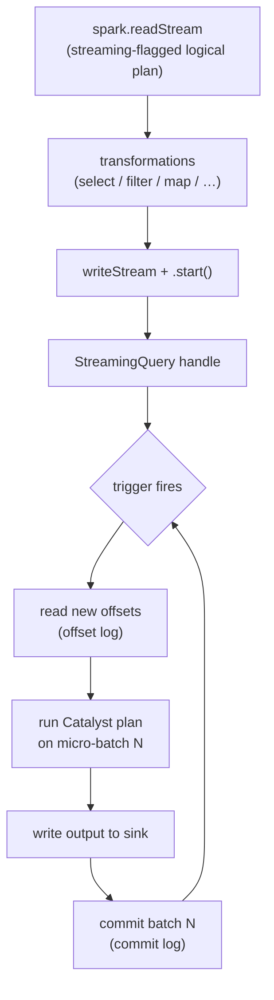

# `readStream` / `writeStream`

> **Tier 1 · Concept 1 of 8**
> The entry and exit points of every Structured Streaming program. Derive *why
> these two entry points exist at all* and the rest of the programming model
> stops feeling arbitrary.

---

## The one-sentence idea

`readStream` and `writeStream` are the two places where you declare to the
engine: *"this query is not a one-shot — execute it incrementally, forever, with
progress tracked and recovery guaranteed."* Everything else in Structured
Streaming hangs off that declaration.

---

## Recap: what we're building on

From Tier 0, Structured Streaming is a **batch query, incrementalized**:

```
result≤T = Q(input≤T)
```

The engine re-evaluates `Q` over new data at each trigger, carries forward the
necessary state, and produces an updated result. `readStream` and `writeStream`
are the two places where you *declare* that incremental execution should happen.

---

## Why `readStream` exists as a separate entry point

The engine needs to know two fundamentally different things about a data source:

1. **Schema** — what shape is each record? (So Catalyst can plan the query.)
2. **Read semantics** — is this source *bounded* (has an end) or *unbounded*
   (never ends, and the engine must track progress through it)?

That second distinction is the entire reason `readStream` exists separately from
`read`.

| Call                | Engine interprets as                                                                  |
| ------------------- | ------------------------------------------------------------------------------------- |
| `spark.read`        | "Bounded dataset — plan a finite job, scan it fully, done."                           |
| `spark.readStream`  | "Unbounded source — plan an *incremental* query, track progress, keep running."       |

The return type is the same:

```scala
spark.read       // → DataFrame  (logical plan over bounded data)
spark.readStream // → DataFrame  (logically identical, but the plan is marked "streaming")
```

Same `DataFrame` type — same Catalyst plan — but the engine attaches a
**streaming flag** to the logical plan. That flag is what later causes:

- the query planner to insert stateful operators where needed,
- the execution engine to loop (trigger → micro-batch → commit) instead of
  running once,
- the checkpoint machinery to engage,
- the planner to **reject operations that have no safe incremental execution**
  (e.g. a full sort of an unbounded stream without a window).

The flag isn't just an execution hint — it's a **correctness gate at planning
time**. Illegal-on-an-unbounded-stream operations fail at `start()`, not at
runtime after consuming gigabytes.

This is the *"incrementalized batch query"* thesis made concrete: you write the
same DataFrame transformation you'd write on a bounded table. `readStream` is
the single place where you declare "execute this incrementally, forever."

---

## `writeStream` — the symmetric commitment

On the output side, `writeStream` is the symmetric declaration: *"don't
materialize this result once — update it continuously, according to a chosen
output mode and trigger."*

```scala
val query = spark.readStream
  .format("kafka")
  .option("subscribe", "events")
  .load()                        // → streaming DataFrame
  .select(/* … */)               // ← ordinary Catalyst transformations
  .writeStream
  .format("console")
  .outputMode("append")
  .option("checkpointLocation", "/tmp/ckpt")
  .start()                       // ← returns StreamingQuery (a running job handle)
```

`.start()` returns a `StreamingQuery` — **not** a `DataFrame`, **not** `Unit`.
That object is your handle to a running background job:

- `query.awaitTermination()` — block the *calling* thread until the query stops,
- `query.stop()` — graceful shutdown,
- `query.lastProgress` / `query.status` — inspect runtime metrics.

Contrast with batch: `df.write.save()` blocks until the job finishes because
there *is* a finish line. A streaming query has **no natural finish line** — it
ends only when `.stop()` is called or the job crashes. If `.start()` blocked,
the driver would hang forever under normal operation: you couldn't launch a
second query, check progress, or handle signals. The `StreamingQuery` handle is
the right abstraction — launch, get a reference, manage it.

> **`StreamingQuery`:** a handle to a long-running streaming job. Returned by
> `start()`. Holds the query's id, name, progress metrics, and lifecycle
> controls. Multiple of these can run concurrently in one Spark session.

---

## The full lifecycle in one picture



The checkpoint commit at the end of each micro-batch is exactly the **commit
log** from Tier 0's delivery-semantics derivation. The offsets read at the start
are exactly the **offset log**. Same machinery — now you can see where it plugs
in.

**Ordering matters:** the sink write happens *before* the commit-log entry. If
the engine writes to the sink but crashes before writing the commit log, on
restart it re-runs batch N — and the sink's idempotency (keyed by `batchId`)
absorbs the duplicate. That ordering is what makes exactly-once *effect*
achievable end-to-end.

---

## One sharp edge worth knowing now

You cannot mix a streaming DataFrame and a batch DataFrame freely. The engine
refuses to plan an unbounded result where it can't reason about state growth.

```scala
val batchDF  = spark.read.parquet("/ref-data")        // bounded
val streamDF = spark.readStream.format("kafka") /*…*/ // unbounded

// Stream–static join: stream drives, static is broadcast/repeated each batch
streamDF.join(batchDF, "id")

// Stream–stream join without watermarks + time bounds — refused at plan time
//    (Tier 2 territory: needs watermarks on both sides + a time constraint)
streamA.join(streamB, "id")
```

That refusal is a **deliberate design constraint**, not a limitation. It forces
you to be explicit about state — which is the whole point of correctness in
streaming.

---

## The streaming-flag corollary, in one line

> `readStream` doesn't return a "different kind of DataFrame." It returns the
> *same* DataFrame with a flag that turns the Catalyst plan into a long-running,
> checkpointed, incremental computation — and gates out operations that have no
> safe incremental meaning.

---

## Spark 3.x → 4.x note

**No gap here.** `readStream` / `writeStream` / `StreamingQuery` are stable
API surface across Spark 3.x and 4.x — identical method signatures, identical
semantics. The version differences (`transformWithState`, RocksDB internals,
State Data Source reader) live *above* this layer, in Tiers 2 and 4. Learn this
once; it is durable.

---

## Prove you got it

1. **The streaming flag.** Both `spark.read` and `spark.readStream` return a
   `DataFrame`. Structurally the type is the same. What is the *actual*
   difference between the two DataFrames, and what does that difference cause
   the engine to do differently — at *plan time* and at *execution time*?
2. **Why `start()` doesn't block.** `writeStream.start()` returns a
   `StreamingQuery` instead of blocking. Why does this make sense architecturally
   — what would go wrong if it blocked instead?
3. **Connecting back to Tier 0.** In the micro-batch loop above, two checkpoint
   interactions appear: "read new offsets" and "commit batch N." Map these onto
   the **offset log** and **commit log** from Tier 0's delivery-semantics work,
   state the *ordering* of sink-write vs commit-log-write, and explain the
   failure scenario each protects against.

<details>
<summary>Answers</summary>

1. The streaming `DataFrame` carries a **streaming flag on its logical plan**.
   At *plan time* the flag turns the planner into a correctness gate: stateful
   operators are inserted where needed, and operations with no safe incremental
   meaning on an unbounded input (e.g. a full sort without a window) are
   *rejected at `start()`* rather than at runtime. At *execution time* the flag
   switches the engine from "run once and finish" to a long-running loop —
   trigger → read new offsets → run the Catalyst plan over the micro-batch →
   write the sink → commit — with checkpointing engaged throughout.
2. A streaming query has **no natural finish line** — it ends only when
   `.stop()` is called or the job crashes. A blocking `.start()` would hang the
   driver thread forever under normal operation: you couldn't launch a second
   query in the same session, inspect progress, or respond to signals. Returning
   a `StreamingQuery` handle gives you a reference to a *running* job that you
   can monitor and control; `awaitTermination()` is then an explicit opt-in to
   block when (e.g.) the driver process should just sit on a single query.
3. **"Read new offsets" = offset log**; **"commit batch N" = commit log**. The
   strict ordering is **sink-write *before* commit-log entry**. The offset log
   protects against **data loss / at-least-once floor**: it records the
   *intent* to process a specific input range, so on crash-and-restart the
   engine deterministically replays from the last unprocessed position — no
   record is silently skipped. The commit log protects against **duplication**:
   if the engine writes to the sink and then crashes *before* writing the
   commit-log entry, on restart it re-runs that same `batchId`; the sink's
   `batchId`-keyed idempotency (or a transactional sink) absorbs the second
   write, so effect-exactly-once holds.

</details>

---

[← Tier 1 index](./README.md) · [Next: Streaming DataFrames & Datasets →](./02-streaming-dataframes-and-datasets.md)