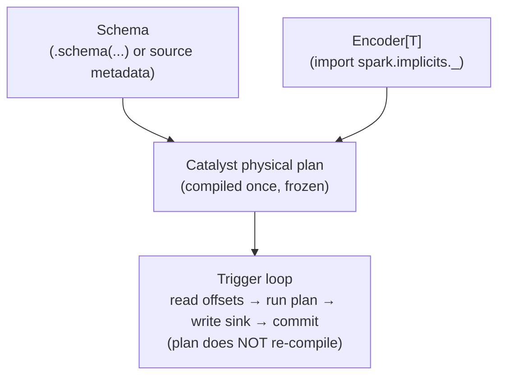

# Streaming DataFrames & Datasets

> **Tier 1 · Concept 2 of 8**
> Two questions that look like API trivia but share a single root cause: why
> schema must be declared up front for most streaming sources, and why
> `Dataset[T]` (the typed API) exists alongside `DataFrame` — and what changes
> when you use it on a stream.

---

## The one-sentence idea

A streaming query is compiled into a physical plan **once**, at `start()`, and
that plan executes against every micro-batch forever. Everything that looks odd
about streaming DataFrames — mandatory schemas, encoder requirements, the
typed/untyped trade-off — is a direct consequence of that single fact.

---

## The root cause: planning happens once, execution runs forever

Recall the streaming-flag picture from Concept 1. When you call `.start()`, the
engine:

1. Takes your logical plan.
2. Validates it (correctness gate).
3. Compiles it via Catalyst into a physical plan.
4. Begins the trigger loop, executing that physical plan against each micro-batch.

That compilation in step 3 happens **once**. The same compiled plan executes
against batch 1, batch 17, batch 9 million. The trigger loop does **not**
re-plan per micro-batch.

This single fact drives almost every "why does streaming behave this way?"
question. It is the streaming-engine equivalent of *"the type system runs at
compile time, not runtime."*

---

## Why schema must be declared up front

In batch Spark, this works:

```scala
val df = spark.read.json("/some/path")   // engine peeks at files, infers schema
```

The engine reads a sample, infers types, and proceeds. Inference is a *bounded*
operation against *bounded* input.

In streaming, the same call is rejected:

```scala
spark.readStream.json("/some/path")
// org.apache.spark.sql.AnalysisException:
// Schema must be specified when creating a streaming source DataFrame.
```

Derive *why* from first principles.

**Argument 1 — planning is one-shot.** Catalyst needs the schema at plan time
to type-check expressions (`col("amount") * 1.1` needs to know `amount` is
numeric), pick physical operators, and generate Tungsten code. Plan time is
*before* any data has arrived. If the schema isn't declared, there is nothing
to infer *from*.

**Argument 2 — even if you waited for the first batch, you would be wrong.**
Suppose the engine waited for batch 1, sampled it, and inferred a schema. What
about batch 2? If batch 2 contains a field batch 1 did not, the compiled plan
cannot handle it — the plan is fixed. The schema is part of the *contract* the
plan was compiled against. Inferring it from a sample of an unbounded stream is
a category error: a sample cannot bind a contract over data that has not
arrived yet.

**Argument 3 — the engine has no time to spare.** Even if inference *were*
sound, sampling enough records to infer reliably would delay the first trigger
by an unbounded amount. Streaming systems are latency-sensitive by nature;
"stall until I have seen enough data to guess your schema" violates the model.

So the rule is: **for any source where the engine cannot get schema from the
source's own metadata, you declare it explicitly.**

```scala
import org.apache.spark.sql.types._

val schema = StructType(Seq(
  StructField("userId",    StringType,    nullable = false),
  StructField("eventType", StringType,    nullable = false),
  StructField("amount",    DoubleType,    nullable = true),
  StructField("eventTime", TimestampType, nullable = false)
))

val events = spark.readStream
  .schema(schema)                  // mandatory for file sources, JSON/CSV, etc.
  .json("/landing/events")
```

The exceptions — sources that *do* carry their own schema:

- **Kafka** — fixed envelope schema:
  `key, value, topic, partition, offset, timestamp, timestampType, headers`.
  The `value` is `binary`; you parse it yourself downstream (see below).
- **Rate / rate-per-micro-batch** — fixed schema: `timestamp, value`.
- **Delta Lake / Iceberg** as a streaming source — schema lives in the table's
  transaction log.

The principle is identical across all of them: **schema must be knowable at
plan time, from somewhere that is not "wait and see."**

### Kafka does not escape the rule — it defers the payload schema

When you read from Kafka, the DataFrame's schema is the *envelope* schema
above. The real event schema lives in the **downstream parser** you write
yourself:

```scala
val eventSchema = StructType(Seq(/* ... */))

val parsed = spark.readStream
  .format("kafka")
  .option("subscribe", "events")
  .load()
  .select(from_json(col("value").cast("string"), eventSchema).as("e"))
  .select("e.*")
```

The contract is still bound at plan time — it is just bound at the *parse* step
rather than the *read* step. Same rule, different location.

---

## `DataFrame` vs `Dataset[T]` — the typed API on a stream

Quick refresher on the batch story; the streaming version is the same machinery
with one extra constraint.

- `DataFrame` is a type alias for `Dataset[Row]`. A `Row` is an untyped
  container — you access fields by name/index and the compiler cannot help you.
- `Dataset[T]` (for a `T` that has an `Encoder`) is the **typed** version: each
  row is materialized as an instance of `T`, and transformations (`map`,
  `filter`, `flatMap`) take typed functions.

```scala
case class Event(userId: String, eventType: String, amount: Double, eventTime: java.sql.Timestamp)

// DataFrame route — untyped, expression-based
events.filter($"amount" > 100)
      .select($"userId", $"amount")

// Dataset[Event] route — typed, function-based
val typed: Dataset[Event] = events.as[Event]
typed.filter(_.amount > 100)
     .map(e => (e.userId, e.amount))
```

Both produce identical Catalyst plans for simple cases. The difference is
**where errors show up**, and **how much the optimizer can see**:

| API           | Field-name typo caught at | Wrong-type usage caught at | Optimizer sees through lambdas |
| ------------- | ------------------------- | -------------------------- | ------------------------------ |
| `DataFrame`   | analysis (start of query) | analysis                   | yes                            |
| `Dataset[T]`  | **compile time**          | **compile time**           | partially (lambdas are opaque) |

That last column matters: Catalyst can rewrite, push down, and codegen
expressions it understands (`$"amount" > 100`). A Scala lambda
(`_.amount > 100`) is opaque — Catalyst calls it as a black box. The typed API
trades some optimizer reach for compile-time safety.

For a streaming query that will run for months, the practical implications cut
in opposite directions:

- **Typed advantage:** a typo like `events.as[Even]` (missing `t`) fails to
  compile. You cannot accidentally deploy a streaming job that crashes on first
  trigger because of a missing case-class field. That is senior-grade
  reliability hygiene from the type system alone.
- **Untyped advantage:** Catalyst can push `$"amount" > 100` into the source
  scan, prune columns, and codegen the entire predicate. Over months and
  billions of records, that compounds.

A common pattern: untyped at the edges (parse, project, filter cheaply), typed
in the core where domain logic lives.

---

## What is the same on a stream

The `Dataset[T]` / `DataFrame` distinction is **entirely orthogonal** to
streaming. `readStream` returns a streaming `DataFrame`; you call `.as[Event]`
to get a streaming `Dataset[Event]`; the streaming flag survives unchanged.

```scala
val eventsDS: Dataset[Event] =
  spark.readStream
    .schema(schema)
    .json("/landing/events")
    .as[Event]                     // typed view of the same streaming plan

eventsDS.filter(_.amount > 100)    // typed filter, still streaming
        .writeStream
        .format("console")
        .start()
```

You have not switched to a different engine. You have put a typed lens over the
same Catalyst plan.

---

## What changes on a stream: `Encoder[T]` becomes non-negotiable

To turn `Row`s into `T`s, Spark needs an `Encoder[T]` — a Catalyst-aware
serializer/deserializer that knows how to map `T`'s fields to Tungsten's binary
row format.

> **`Encoder[T]`:** a Catalyst-aware codec for `T`. Tells the engine how to lay
> out a `T` as a Tungsten binary row (off-heap, columnar-friendly) and how to
> read it back. The reason `Dataset[T]` is fast despite being typed — encoders
> avoid Java serialization entirely.
>
> **Tungsten:** Spark's binary in-memory row format (off-heap, cache-friendly).
> Codegen targets it directly. Encoders are the bridge between your Scala type
> and this format.

In Scala you almost never write an encoder by hand. The line

```scala
import spark.implicits._
```

brings into scope a family of **implicit encoders** for primitives, tuples,
`Option`, collections, and — via macro derivation — case classes. So
`events.as[Event]` resolves an `Encoder[Event]` implicitly, and it works.

> **Implicits, briefly:** an `implicit` value (in Scala 2) or `given` instance
> (in Scala 3) is a value the compiler is allowed to supply automatically when
> a method asks for it via `implicit`/`using`. `as[T]` requires
> `(implicit enc: Encoder[T])`. The import puts the right encoders in implicit
> scope so you do not pass them by hand. The encoders themselves are generated
> at compile time by a macro that reflects on `T`'s structure.

**Why non-negotiable on a stream?** Because the encoder, like the schema, is
bound into the compiled plan at `start()`. The trigger loop will materialize
*millions* of `T` instances over the query's lifetime; the encoder is the
per-record codec for that loop. If you `.as[T]` for a `T` whose encoder cannot
be derived — say, a class with a non-encodable field — you find out at plan
time, not after batch 47 fails in production.

---

## The schema/encoder symmetry

There are two contracts a streaming query is compiled against, both fixed at
plan time:

| Contract       | What it binds                                | Where it comes from                                            |
| -------------- | -------------------------------------------- | -------------------------------------------------------------- |
| **Schema**     | Field names and types in the input rows      | Source metadata (Kafka, Delta) or your explicit `.schema(...)` |
| **Encoder[T]** | How `T` maps to/from Tungsten binary rows    | `import spark.implicits._` (macro-derived for case classes)    |



If the source itself does not carry schema, you supply it. If you want a typed
view, you supply (transitively, via implicits) an encoder. Both must be
resolvable before the trigger loop starts, because the trigger loop will not
stop to ask.

The asymmetry worth remembering: **encoder is checked at compile time** (it
resolves via implicits during compilation), **schema is checked at plan time**
(it is supplied as a value to a method call that executes at `start()`).
Different failure moments, same architectural role.

---

## Spark 3.x → 4.x note

No behavioural gap on this concept. `Encoder[T]` derivation,
`import spark.implicits._`, and the schema requirement are stable across Spark
3.x and 4.x. In Scala 3 the same machinery uses `given`/`using` under the hood,
but `import spark.implicits._` continues to work — the syntactic change does
not reach this layer.

---

## Prove you got it

1. **The inference rejection.** A junior teammate writes
   `spark.readStream.json("/in")` and is confused that it fails — "the batch
   version infers schema just fine." Give them the first-principles answer in
   two or three sentences. The phrase "plan time" should appear.
2. **Why Kafka does not need `.schema(...)`.** Kafka is the most common
   streaming source and you never call `.schema(...)` on it. Reconcile this
   with the rule above. What does the resulting DataFrame's schema actually
   look like, and where does the *real* schema of your event payload show up
   in the code?
3. **Typed vs untyped trade-off.** You write:
   ```scala
   val typed: Dataset[Event] = events.as[Event]
   typed.filter(_.amount > 100)
   ```
   versus:
   ```scala
   events.filter($"amount" > 100)
   ```
   For a streaming query that will run for months, name one concrete advantage
   of each form. Then state which contract — schema or encoder — is checked at
   compile time, and which only at plan time (i.e. when `.start()` is called).

<details>
<summary>Answers</summary>

1. Spark's engine compiles a query into a physical plan *before* any data
   arrives — that is **plan time**. Catalyst needs the schema then to type-check
   expressions, pick operators, and generate code. Batch can infer because the
   input is bounded and the inference itself is a finite job that runs before
   execution; streaming cannot, because the input is unbounded (a sample
   binds no contract over data not yet seen) *and* because the physical plan
   is compiled **once** and reused for every micro-batch — a schema discovered
   from batch 1 cannot retroactively constrain batch 17.
2. Kafka does carry a schema — the fixed envelope
   `key, value, topic, partition, offset, timestamp, timestampType, headers` —
   so the plan-time contract is satisfied without `.schema(...)`. The `value`
   column is raw `binary`. The *real* payload schema appears downstream in
   your parser, typically
   `select(from_json(col("value").cast("string"), eventSchema))`. The rule
   still holds: schema is knowable at plan time, just supplied at the parse
   step rather than the read step.
3. **Typed advantage:** field-name and type errors surface at *compile time*
   (e.g. `events.as[Even]` fails to compile), so a long-running query cannot
   be deployed with a class of bug that the untyped form would discover only
   when the query starts. **Untyped advantage:** Catalyst sees through
   `$"amount" > 100` and can rewrite, push down, prune columns, and codegen
   — gains that compound over months of execution; a Scala lambda is opaque
   to the optimizer. **Encoder is checked at compile time** (implicit
   resolution happens during compilation); **schema is checked at plan time**
   (the value is supplied to a call that runs at `.start()`).

</details>

---

[← Tier 1 index](./README.md) · [Previous: `readStream` / `writeStream` ←](./01-readstream-writestream.md) · [Next: Sources & Replayability →](./03-sources-and-replayability.md)