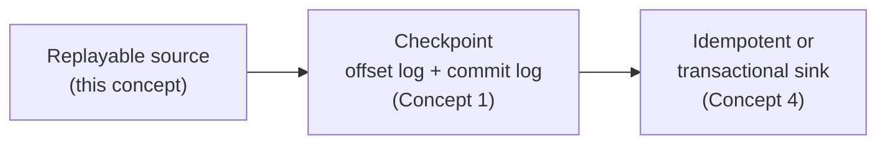

# Sources & Replayability

> **Tier 1 · Concept 3 of 8**
> The first leg of the end-to-end exactly-once chain. Tier 0 proved that
> exactly-once-*effect* requires a replayable source, a checkpoint, and an
> idempotent or transactional sink. This concept examines what "replayable"
> actually means and which Spark sources satisfy it.

---

## The one-sentence idea

A source is **replayable** if, given an offset range it processed before, it
can return the *same* records on a subsequent read. Without that property no
amount of checkpoint machinery downstream can buy you exactly-once — the
guarantee collapses to at-most-once at the source itself.

---

## Why replayability is the source's half of the contract

Recall the failure scenario from Tier 0: the engine processes batch N, writes
output to the sink, then crashes *before* committing the batch. On restart, the
engine must re-execute batch N — same input, same output — so the sink's
`batchId`-keyed idempotency can absorb the duplicate.

That re-execution is only possible if the source can **hand the engine the
same records again**. Concretely:

> A source is **replayable** if, given an offset range `[start, end)` it
> processed before, it can return the *same* records on a subsequent read.

This is stronger than "the source remembers what it sent." The source must
support **addressable, deterministic re-reads** of a previously processed
range. The engine remembers offsets in its own checkpoint (the offset log);
the source must honour those offsets by yielding the same data.

Without replayability, the engine cannot honour the offset log's promise — and
the whole exactly-once edifice collapses. There is no workaround at the sink
layer.

---

## The three properties that make a source replayable

Break replayability into its components:

1. **Addressable positions.** The source exposes a notion of "where I am" that
   the engine can record. Kafka offsets, file modification times, Delta version
   numbers. A source with no addressable position cannot be checkpointed.
2. **Deterministic re-read.** Given a recorded position, the source returns the
   *same* records on every read. This requires retention of past data — if data
   has been deleted between the original read and the replay, determinism is
   gone.
3. **Monotonic progress.** Positions advance forward only. The engine never
   goes backwards in the offset log under normal operation; replay is the
   *only* legitimate backward motion, and it must produce identical data to
   the original read.

A source either satisfies all three, or it does not provide exactly-once. There
is no middle position.

---

## Walking through the four sources

### File source — replayable, with a caveat

```scala
spark.readStream
  .schema(schema)
  .json("/landing/events")
```

**Addressable positions:** yes — the engine maintains a list of files it has
already processed in the checkpoint. The offset log records the *set of file
paths* seen up to each batch.

**Deterministic re-read:** yes, *if the files are immutable*. This is the
caveat. File sources assume files appear, are read in full, and are never
modified. If something rewrites `events-2026-05-30.json` between batches, the
second read returns different bytes — determinism violated. In practice this
means landing zones must be append-only, and tooling that "fixes up" files (a
misguided cron job rewriting yesterday's data) silently breaks exactly-once.

**Monotonic progress:** yes — the file list only grows.

So file sources *are* replayable, but the guarantee is borrowed from the
storage layer's immutability rather than enforced by the source itself.

> **Practical note worth burning in:** the file source tracks *which files*
> have been seen, not *which records*. It always reads the whole file. If a
> file is half-written when the engine sees it, you get partial-record
> corruption. Most production setups use atomic-rename patterns: write to
> `_tmp/`, then `mv` into the watched directory once complete.

### Socket source — not replayable (development only)

```scala
spark.readStream.format("socket")
  .option("host", "localhost")
  .option("port", 9999)
  .load()
```

**Addressable positions:** no. A TCP socket has no notion of "give me the
bytes from position 1,427 onwards." Data flows past and is gone.

**Deterministic re-read:** impossible — there is nothing to re-read from.

**Monotonic progress:** trivially yes, because you cannot go back.

The socket source is **at-most-once by construction**. The Spark documentation
labels it "for testing only" for exactly this reason. Use it to demo a
streaming query in three lines (`nc -lk 9999 | spark`), then never again.
Critically: a query reading from a socket with a checkpoint configured looks
superficially the same as a query reading from Kafka — but if the driver dies,
the in-flight data is gone forever, regardless of what the checkpoint says.

### Rate source — replayable in a trivial sense

```scala
spark.readStream.format("rate").option("rowsPerSecond", 100).load()
```

This is a synthetic source: it produces `(timestamp, value)` rows at a
configured rate. There is no real input; the engine *generates* records on
demand.

**Addressable positions:** yes — the offset is essentially "how many rows
have I emitted." The next read produces the next chunk.

**Deterministic re-read:** yes, but in a degenerate way — re-reading a range
produces records with the same `value` field (since `value` is a monotone
counter) but the `timestamp` field reflects *generation time*, which differs
on replay. For most testing purposes this is fine; for any test that depends
on `timestamp` equality, it is a trap.

**Monotonic progress:** yes.

The rate source's role is to be a knob-controlled traffic generator for
testing windowing, watermarks, and back-pressure. Do not build correctness
intuitions from it that depend on bit-for-bit re-read.

### Kafka source — replayable by design

```scala
spark.readStream
  .format("kafka")
  .option("kafka.bootstrap.servers", "broker:9092")
  .option("subscribe", "events")
  .option("startingOffsets", "earliest")
  .load()
```

This is the source that earns the exactly-once story.

**Addressable positions:** Kafka offsets — a `(topic, partition, offset)`
triple identifies every record uniquely and durably. The engine records
ranges like *"partition 0: offsets 1000–1500, partition 1: offsets 850–1400"*
in the offset log. These triples are the canonical "position" abstraction in
streaming.

**Deterministic re-read:** yes, within the broker's **retention window**.
Kafka stores records on disk for a configured time (default 7 days) or size.
Within that window, a re-read of the same offset range yields byte-identical
records.

> **The retention trap.** If retention is 7 days and your job is down for 8,
> the offsets in your checkpoint point to records Kafka has deleted. On
> restart, the engine asks for offset 2000 of partition 0; the broker
> responds with an `OffsetOutOfRangeException` because the earliest available
> offset is 5000. The default behaviour is to **fail the query** (loud, safe).
> The option `failOnDataLoss = false` tells Spark to swallow the exception
> and reset to the earliest available offset — meaning batch N+1 starts at
> offset 5000 and offsets 2000–4999 are **silently skipped**. You will not
> notice until someone runs a reconciliation report. This is the reason
> senior DEs monitor consumer lag *as a percentage of retention*, not just
> in absolute terms.

**Monotonic progress:** yes, per partition. Offsets are strictly increasing
within a partition.

Two configuration knobs worth knowing now (deeper in Tier 3):

- **`startingOffsets`** — `"earliest"` / `"latest"` / explicit JSON. Only
  consulted when the checkpoint is empty (first run). Once a checkpoint
  exists, the *checkpoint* dictates where to resume; `startingOffsets` is
  ignored. The checkpoint is the source of truth for "where we are," not
  the configuration.
- **`maxOffsetsPerTrigger`** — caps how many offsets per micro-batch. The
  defence against the post-downtime scenario above: after 8 hours down, you
  do not want one giant batch trying to consume 8 hours of Kafka in one
  shot. Cap it so recovery is incremental.

---

## The replayability ladder, summarised

| Source | Addressable      | Deterministic re-read     | Monotonic            | Verdict                            |
| ------ | ---------------- | ------------------------- | -------------------- | ---------------------------------- |
| File   | yes (file list)  | yes, if files immutable   | yes                  | replayable, with storage caveat    |
| Socket | no               | no                        | trivially            | **at-most-once only — dev use**    |
| Rate   | yes (counter)    | yes, except `timestamp`   | yes                  | replayable, synthetic              |
| Kafka  | yes (offset triples) | yes, within retention | yes (per partition)  | **fully replayable**               |

Only the Kafka row supports production exactly-once unconditionally. The file
source is workable if you control the storage layer. The other two have
specific, narrow purposes.

---

## The semantics ladder

Three rungs, weakest to strongest:

- **At-most-once.** Every record is delivered zero or one times. Data loss
  possible; duplicates impossible. The socket source sits here — on a crash,
  in-flight records are gone.
- **At-least-once.** Every record is delivered one or more times. No data
  loss; duplicates possible on replay. Replayable source + checkpoint alone
  give you this.
- **Exactly-once *effect*.** Every record's effect on the sink is observed
  exactly once. Requires replayable source **and** checkpoint **and**
  idempotent/transactional sink.

The sink's idempotency is what *converts* at-least-once into exactly-once
effect. Without it you have full delivery without uniqueness; with it you
have both.

---

## Why this connects back to the checkpoint

In Concept 1 we drew the trigger loop with "read new offsets" and "commit
batch N" as the two checkpoint touchpoints. Now you can see what those entries
are actually *referring to* — positions in the source's address space:

- **Offset log entry for batch N**: "I intend to process source positions
  `[start_N, end_N)`." Written **before** the batch executes.
- **Commit log entry for batch N**: "Batch N is durably written to the sink."
  Written **after**.

If the source cannot honour the offset-log positions on replay, the offset
log is a fiction. The checkpoint mechanism is necessary for exactly-once but
not sufficient — the source has to play its part.

The full chain, now visible at all three points:



Concept 4 picks up the third leg.

---

## Spark 3.x → 4.x note

No behavioural gap on this concept. The file, socket, rate, and Kafka sources
behave identically across Spark 3.x and 4.x at the level of replayability
semantics. Newer source types — Delta, Iceberg, Kinesis connectors — extend
the catalogue but follow the same three-property test.

---

## Prove you got it

1. **The socket trap.** A teammate has built a streaming demo reading from a
   socket, with a checkpoint configured. They say "it has a checkpoint, so it
   is exactly-once." In two or three sentences, explain why they are wrong —
   using the three-property framework, not just "the docs say so."
2. **The retention trap, derived.** Walk through what happens, step by step,
   when a Spark streaming job reading Kafka goes down for longer than the
   broker's retention window — and then restarts. Mention the offset log,
   the broker state, and the default-vs-`failOnDataLoss=false` behaviours.
   End with a one-sentence statement of what the senior-grade monitoring
   metric is.
3. **The chain.** End-to-end exactly-once requires a replayable source, a
   checkpoint, and an idempotent/transactional sink. Suppose you correctly
   use Kafka (replayable) and configure a checkpoint, but write to a sink
   that is *not* idempotent — for example, an HTTP endpoint that creates a
   row per call with no deduplication. What delivery semantics do you
   actually get end-to-end, and where in the chain does the guarantee break?

<details>
<summary>Answers</summary>

1. The checkpoint's offset log records *the addresses* of records the engine
   intends to process — it depends on the source being able to return the
   same records when handed the same address back. A TCP socket fails the
   first replayability property (no addressable position) and the second
   (no deterministic re-read, because in-flight data is gone after the
   crash). The checkpoint's promise is therefore unenforceable; the
   semantics drop to **at-most-once** — on a crash, in-flight records are
   lost, not duplicated.
2. The offset log records that batch N is to process, say, offsets 2000–2500
   of partition 0. The job goes down. Beyond the broker's retention window,
   Kafka deletes everything up to offset 5000. On restart, the engine reads
   its offset log and asks the broker for offset 2000; the broker responds
   with an `OffsetOutOfRangeException` because the earliest available is
    5000. Default behaviour: the query **fails loudly** — safe. With
          `failOnDataLoss = false`: Spark swallows the exception, resets to offset
          5000, and offsets 2000–4999 are **silently skipped** — data loss without
          any visible symptom. Senior-grade monitoring tracks **consumer lag as a
          percentage of retention**, not just absolute lag.
3. End-to-end delivery is **at-least-once**. Replayable source + checkpoint
   guarantee no records are lost — on crash, the engine replays the
   uncommitted batch from Kafka. But because the sink has no `batchId`-keyed
   dedup or transactional commit, the replayed records are re-written as new
   rows; duplicates become visible downstream. The guarantee breaks at the
   **sink leg** of the chain: the at-least-once floor holds, but the sink
   cannot absorb the duplicate to lift it to exactly-once effect.

</details>

---

[← Tier 1 index](./README.md) · [Previous: Streaming DataFrames & Datasets ←](./02-streaming-dataframes-and-datasets.md) · [Next: Sinks & `foreachBatch` →](./04-sinks-and-foreachbatch.md)