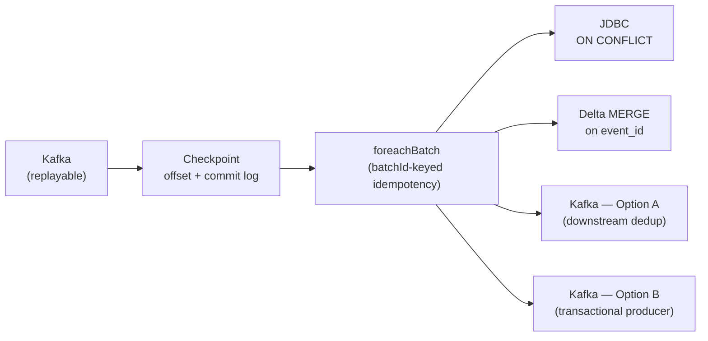

# Sinks & `foreachBatch`

> **Tier 1 · Concept 4 of 8**
> The third leg of the exactly-once chain — and practically the most important
> concept in all of Tier 1. The course covers the built-in sinks; what
> separates a senior DE is knowing why most of them are inadequate for
> production and how `foreachBatch` becomes the universal answer.

---

## The one-sentence idea

A sink's job is to absorb the **at-least-once** delivery the upstream legs
guarantee and convert it into **exactly-once effect**. Every built-in sink
either does this for a narrow case or does not do it at all; `foreachBatch`
hands the per-batch DataFrame back to you so you can do it correctly for
*any* target.

---

## The contract: what a sink must do to close the chain

From the chain you have already built:

```
replayable source → checkpoint (offset + commit log) → idempotent/transactional sink
```

The sink must do one of two things when batch N is delivered to it a second
time (after a crash before commit):

- **Idempotency.** Recognise it has already written batch N's output (via
  `batchId` or a deterministic key on the records) and *do nothing* the
  second time. The state of the sink after one write equals the state after
  two writes.
- **Transactionality.** Make the write of batch N's output atomic with the
  *commit*, so that either both happen or neither happens. On replay, the
  engine sees the commit was never made and writes again; otherwise, the
  previous write is already complete and the engine skips.

Two mechanisms, one outcome: **batch N has exactly-once effect on the sink,
regardless of how many times the engine retries it.**

> **The unit of idempotency is the batch, not the record.** The engine's
> recovery unit is the batch — so you think `batchId`-by-`batchId`, not
> record-by-record. This insight is what makes `foreachBatch` viable for
> sinks whose records have no natural unique key (aggregated rollups,
> synthetic identities, hourly counts).

---

## The built-in sinks, measured against the contract

### Console sink — debugging only

```scala
.writeStream.format("console").outputMode("append").start()
```

Prints rows to the driver's stdout. No `batchId` recorded anywhere durable;
on replay you simply see the records printed again. Useful for development
and for verifying a query is producing what you expect. **Not a sink** in
the exactly-once sense — it has no persistent state to compare against.

### Memory sink — testing only

```scala
.writeStream.format("memory").queryName("results").start()
// then: spark.sql("SELECT * FROM results")
```

Materialises the output as an in-memory table you can query from the same
SparkSession. Same story as console: not durable, not idempotent, **for
tests only**. We will see this again in Tier 5 with `MemoryStream` for
deterministic streaming tests.

### File sink — append-only, idempotent via manifests

```scala
.writeStream.format("parquet").option("path", "/out").outputMode("append").start()
```

Genuinely exactly-once for the append-only case. The mechanism: the file
sink writes a **manifest file** per batch listing which output files belong
to batch N. On replay, if the manifest for batch N already exists, the
engine skips re-writing. The manifest is the sink's idempotency token,
keyed by `batchId`.

Limitations:

- **`append` output mode only.** You cannot `update` or `complete` to a
  file sink — there is no way to retract or overwrite previously written
  files atomically on most filesystems.
- **No upserts.** Plain Parquet cannot maintain a current-state table.
  That gap is exactly why Delta Lake and Iceberg exist.
- **Small-files problem.** Each micro-batch writes new files. A 10-second
  trigger over a year produces ~3 million files. Compaction required
  (Tier 3/4 territory).

### Kafka sink — at-least-once by default

```scala
.writeStream.format("kafka")
  .option("kafka.bootstrap.servers", "broker:9092")
  .option("topic", "processed")
  .start()
```

**At-least-once by default, not exactly-once.** This is where many teams
get burned. On replay of batch N, the producer re-sends the records — and
Kafka has no way to know these are duplicates of a previous send. Kafka
stores what you give it; identical bytes at different offsets are
*different records* as far as Kafka is concerned. Achieving exactly-once
into Kafka requires either downstream-consumer dedup or a transactional
producer (covered below).

### JDBC sink — does not exist

There is no `.format("jdbc")` for `writeStream`. The course covers JDBC by
way of `foreachBatch` precisely because Spark's authors did not ship one —
and that omission is **correct**. There is no general way to do an
idempotent JDBC write that works across all databases. Postgres has
`ON CONFLICT`, MySQL has `ON DUPLICATE KEY UPDATE`, SQL Server has
`MERGE`, Oracle has `MERGE`, SQLite has `INSERT OR REPLACE`. The engine
cannot abstract over those, so it hands you the per-batch DataFrame and
lets you decide.

The non-existence is the cue that `foreachBatch` is the production answer.

---

## `foreachBatch` — the universal escape hatch

The signature is unassuming:

```scala
def foreachBatch[T](function: (Dataset[T], Long) => Unit): DataStreamWriter[T]
```

You pass a function. The engine calls it **once per micro-batch**, passing:

1. **`Dataset[T]`** — the output of the streaming query for *this
   micro-batch*, materialised as an ordinary, bounded `Dataset`. Inside
   the function, you can do *anything you can do in batch Spark*.
2. **`Long`** — the `batchId`. Monotonically increasing across batches.
   **This is the idempotency token.**

That is the whole API. Three implications.

### Implication 1 — you have re-entered the batch world

Inside the function, `df` is a *bounded* DataFrame. The streaming-flag is
gone for the duration of the call. Every batch Spark API works:
`df.write.jdbc(...)`, `df.write.format("delta").mode("overwrite").save(...)`,
`df.write.partitionBy(...)`, joins to other tables, calls to JDBC, REST,
`MERGE` into Delta — anything.

This is the **single most important pattern in production streaming**:
streaming defines *when* and *what data*; `foreachBatch` defines *how to
write it*, in the full vocabulary of batch Spark.

### Implication 2 — `batchId` is your idempotency key

The engine guarantees: on retry of batch N, your function is called with
the *same* `batchId = N` and the *same* `df` contents (because the source
is replayable, the offset log says where to read, and the trigger boundary
is deterministic).

**Pattern A — JDBC with `ON CONFLICT`:**

```scala
events.writeStream.foreachBatch { (df: Dataset[Row], batchId: Long) =>
  df.write
    .mode("append")
    .option("isolationLevel", "NONE")
    .jdbc(jdbcUrl, "_staging_events", connectionProps)

  // Then in a transaction on the JDBC side:
  //   INSERT INTO events SELECT * FROM _staging_events
  //   ON CONFLICT (event_id) DO NOTHING;
}.option("checkpointLocation", "/ckpt").start()
```

Dedup happens at the database, on a stable key (`event_id`).

**Pattern B — Delta Lake `MERGE`:**

```scala
events.writeStream.foreachBatch { (df: Dataset[Row], batchId: Long) =>
  val target = DeltaTable.forPath(spark, "/lake/events")
  target.as("t")
    .merge(df.as("s"), "t.event_id = s.event_id")
    .whenMatched.updateAll()
    .whenNotMatched.insertAll()
    .execute()
}.option("checkpointLocation", "/ckpt").start()
```

Delta's `MERGE` is itself transactional. On retry, records already merged
update to the same values (idempotent because the merge is keyed on
`event_id`).

**Pattern C — Per-batch idempotency table (no natural key):**

When records have no natural unique key — aggregated rollups, synthetic
identities, hourly counts — `batchId` itself becomes the dedup token. The
robust version writes the data and the processed-batch marker **atomically
in the same transaction**:

```scala
events.writeStream.foreachBatch { (df: Dataset[Row], batchId: Long) =>
  // Postgres pattern, executed in a single JDBC transaction:
  //   BEGIN;
  //   INSERT INTO results SELECT * FROM <batch>;
  //   INSERT INTO processed_batches (batch_id) VALUES (batchId);
  //   COMMIT;
  // If the COMMIT fails, both writes roll back — clean replay.
}.option("checkpointLocation", "/ckpt").start()
```

The weaker variant — check the table, write, then record — has a race
window: a crash *between* the data write and the marker insert leaves the
data written but the marker missing, so replay writes again. Acceptable
only when the target cannot do both writes in one transaction (e.g. data
to S3 and marker to Postgres).

### Implication 3 — multiple sinks per batch

```scala
events.writeStream.foreachBatch { (df: Dataset[Row], batchId: Long) =>
  df.persist()             // cache the batch; we use it twice
  df.write.format("delta").mode("append").save("/lake/events")
  df.filter($"is_alert").write.jdbc(url, "alerts", props)
  df.unpersist()
}.option("checkpointLocation", "/ckpt").start()
```

Impossible with the built-in `format(...)` sinks (one sink per query).
This is the **fan-out pattern** underlying medallion architectures and
dead-letter queues.

> **`df.persist()` inside `foreachBatch` is not optional.** Without it,
> every action on `df` re-runs the entire upstream Catalyst plan over the
> source for that batch — for Kafka, that means re-reading and re-parsing.
> Persist once, reuse many times, unpersist.

---

## `foreachBatch` vs `foreach`

A sibling API, `foreach`, takes a `ForeachWriter[T]` and operates
**row-by-row**. It is for sinks where row-at-a-time semantics are
necessary (a non-batchable HTTP endpoint with strict ordering, for
example). It is lower-level and rarely the right choice for data
engineering. `foreachBatch` lets you treat the micro-batch as a bounded
`DataFrame` and use all of batch Spark; `foreach` does not. For the
portfolio project, default to `foreachBatch`.

---

## Kafka → Spark → Kafka exactly-once: the two options

When the *sink* itself is Kafka and you want true exactly-once, there are
two architectural paths. They sit at different points on the
complexity/guarantee curve.

### Option A — Downstream-idempotent consumer (pragmatic)

Accept that the Kafka output topic may contain duplicates; push dedup
responsibility to whatever reads that topic.

**Steps:**

1. Spark writes to the Kafka output topic with the default at-least-once
   producer. Duplicates possible after a crash.
2. Each event carries a stable application-level key — `event_id`,
   `user_id + event_time`, whatever is unique by your domain.
3. The downstream consumer treats the topic as at-least-once and dedupes
   at write time. If the consumer is itself Spark writing to Delta via
   `MERGE`, the merge on `event_id` dedupes naturally. If it is a
   service writing to Postgres, `ON CONFLICT (event_id) DO NOTHING`
   does the same.

**Gain:** simplicity. No transactional producers, no Kafka transactions
to operate.
**Trade-off:** the Kafka topic itself contains duplicates. Anything
*between* the producer and the final sink — a monitoring dashboard, an
audit log, a third-party integration — sees them. Exactly-once is
achieved *at the final sink only*, not on the wire.

**When to use:** when there is one well-known final sink and intermediate
Kafka topics are operational plumbing. This is the common case and the
right default for most pipelines.

### Option B — Transactional Kafka producer (on-the-wire exactly-once)

Make the Kafka write of batch N's records atomic with the offset-commit
of batch N's inputs, so the output topic itself never contains
duplicates.

The mechanism Kafka provides is **transactions** with a **transactional
producer**. The producer is identified by a stable `transactional.id`,
and Kafka maintains a per-producer transaction log. Writes within a
transaction are invisible to consumers (set to `read_committed`) until
commit; the broker fences out previous instances of the same
`transactional.id` to prevent zombie producers.

**Steps inside `foreachBatch`:**

1. **Begin transaction.** `producer.beginTransaction()`. Subsequent
   writes are held in a pending state.
2. **Write the batch.** Records sent to the output topic via the
   transactional producer; written to the broker but invisible to
   `read_committed` consumers.
3. **Send input offsets to the transaction.**
   `producer.sendOffsetsToTransaction(offsets, consumerGroupId)`. This
   binds "I consumed these input offsets" and "I produced these output
   records" into one atomic unit.
4. **Commit transaction.** `commitTransaction()` atomically makes the
   output records visible *and* durably records the input offsets as
   consumed.
5. **On crash before commit:** the transaction is pending. The broker
   eventually aborts it (transaction timeout, or the new producer
   instance fencing the old). Output records are *never* made visible
   to `read_committed` consumers. On restart, Spark replays the batch;
   the new transaction writes again and commits cleanly. Output topic
   sees the records exactly once.
6. **On crash after commit:** durable. Spark's checkpoint sees batch N
   was committed and moves on. No replay needed.

```scala
// Sketch — production code is more careful around producer lifecycle
// and partitions the work across executors rather than collecting to
// the driver.
events.writeStream.foreachBatch { (df: Dataset[Row], batchId: Long) =>
  val producer = getOrCreateTxnProducer(transactionalId = s"spark-output-${queryId}")
  producer.beginTransaction()
  try {
    df.collect().foreach { row =>
      producer.send(new ProducerRecord("output-topic",
        row.getAs[String]("key"), row.getAs[String]("value")))
    }
    producer.sendOffsetsToTransaction(currentInputOffsets, "spark-consumer-group")
    producer.commitTransaction()
  } catch {
    case e: Exception =>
      producer.abortTransaction()
      throw e
  }
}
```

**Gain:** the Kafka output topic itself is exactly-once. Any number of
downstream consumers, including ones you do not control, see each
record exactly once with no dedup logic of their own.

**Trade-offs:**

- **Operational complexity.** `transactional.id` must be stable across
  restarts; the broker fences zombies; transactions have timeouts.
- **Performance.** Transactions add latency — each commit is a
  coordination round-trip with the broker's transaction coordinator.
  Throughput drops noticeably.
- **`collect()` is expensive.** Production implementations partition
  the work across executors, each with its own transactional producer
  keyed by `(transactionalId, partitionId)`. The bookkeeping to ensure
  no two attempts of the same partition collide is non-trivial. Most
  teams do *not* roll this themselves; they use a connector or
  framework that handles it (Kafka Connect, or Flink's two-phase-commit
  sink).
- **Spark's built-in Kafka sink does not do this.** You write it
  yourself in `foreachBatch` and own the operational complexity.

**When to use:** when the Kafka topic is a contract with external
consumers — a downstream team that does not control its dedup logic, or
a regulatory requirement for exactly-once delivery on the wire. For
internal pipelines, Option A almost always wins on cost/benefit.

### Recommendation for the portfolio project

Use **Option A** by default. If you want to demonstrate awareness of
Option B, mention it in an Architecture Decision Record:

> We chose Option A because our final sink is Delta with `MERGE` on
> `event_id`, which dedupes at the lakehouse layer. Option B
> (transactional producer) would have provided on-the-wire exactly-once
> but at the cost of throughput and operational complexity, neither of
> which is justified for an internal pipeline with one known consumer.

That sentence alone signals senior-level thinking.

---

## Sinks measured against the contract — summary

| Sink                     | Idempotent?              | Output modes              | Production use                              |
| ------------------------ | ------------------------ | ------------------------- | ------------------------------------------- |
| `console`                | n/a (no persistence)     | all                       | debugging only                              |
| `memory`                 | n/a (no persistence)     | all                       | testing only                                |
| `file` (parquet/json/…)  | yes (manifest per batch) | `append` only             | append-only lakes; needs compaction         |
| `kafka`                  | **no** (default)         | `append`, `update`        | requires Option A or B for E1               |
| `jdbc` (does not exist)  | n/a                      | n/a                       | use `foreachBatch` + `MERGE`/`ON CONFLICT`  |
| **`foreachBatch`**       | **yours to design**      | any (you control output)  | the production answer                       |

Every production-grade sink is either Delta/Iceberg's transactional
`MERGE` or `foreachBatch` wrapping a sink-specific idempotent write.
Built-in sinks cover the easy cases only.

---

## Closing the chain

You now have all three legs:



The `batchId` the engine passes to your function is *the same `batchId`*
that appears in the commit log. On retry, the engine knows batch N was
started but not committed; it re-runs your function with the same
`batchId`; your function recognises the duplicate (via `MERGE`,
`ON CONFLICT`, or a processed-batches table) and absorbs it. End-to-end
exactly-once effect, no record-level guarantees required.

This is the senior-grade pattern. Internalise it.

---

## Spark 3.x → 4.x note

`foreachBatch` is stable across Spark 3.x and 4.x — same signature, same
semantics. Delta Lake's `MERGE` API has evolved (Delta 3.x adds
`whenNotMatchedBySource`, deletion vectors), and the State Data Source
reader (Spark 4.0) makes debugging `foreachBatch` interactions with
stateful operators upstream much easier. None of that changes the core
pattern in this concept.

---

## Prove you got it

1. **Why no JDBC sink.** Spark ships Kafka and file sinks but
   deliberately did not ship a JDBC streaming sink. Reconstruct the
   design reasoning in two or three sentences — why is this absence
   *correct*, and what is the design-time signal it sends to a senior
   DE?
2. **The `batchId` insight.** A teammate says: "for exactly-once into
   Postgres, I need to add a unique constraint on the source's event ID
   and use `ON CONFLICT (event_id) DO NOTHING`." That works, but
   `foreachBatch` makes a *weaker* requirement possible — what is it,
   and how would you implement it for a sink whose records have no
   natural unique key at all?
3. **The Kafka sink trap.** Your pipeline is Kafka → Spark → Kafka, all
   with checkpoints configured. You believe you have exactly-once
   because Kafka is replayable on both ends and the checkpoint is in
   place. Explain why this is wrong by default, then name the two
   architectural options for fixing it, including which side bears the
   dedup responsibility in each and the operational cost of each.

<details>
<summary>Answers</summary>

1. There is no universal idempotent-write primitive across JDBC
   databases — Postgres has `ON CONFLICT`, MySQL has `ON DUPLICATE KEY
   UPDATE`, SQL Server and Oracle have `MERGE`, SQLite has
   `INSERT OR REPLACE`. Spark cannot ship one sink that does the right
   thing everywhere, so it deliberately ships none and hands the
   per-batch DataFrame back via `foreachBatch`. The architectural
   signal: when Spark refuses to provide a "generic" sink for
   something, the *correctness boundary* lives in the target system,
   not in Spark — and `foreachBatch` is the engine's way of saying
   "you cross that boundary, not us."
2. The weaker requirement is: the *batch*, not the record, needs to be
   idempotent. `foreachBatch` exposes the `batchId`, which is stable
   across retries of the same batch — so you maintain a
   `processed_batches` table keyed by `batchId`, and the production
   pattern writes the data *and* the marker atomically in the same
   transaction (Postgres: `BEGIN; INSERT INTO results …; INSERT INTO
   processed_batches (batch_id) VALUES (N); COMMIT;`). On replay of
   batch N, the second transaction either rolls back cleanly (if the
   first committed) or succeeds (if the first did not). Works even
   when the records have no natural unique key — aggregated rollups,
   synthetic identities, hourly counts.
3. Kafka does not dedupe by content; identical bytes at different
   offsets are different records as far as Kafka is concerned. The
   default Spark Kafka sink is at-least-once, so on replay of batch N
   it re-sends the records and the output topic gets duplicates. Two
   fixes:
    - **Option A (downstream-dedup):** keep the at-least-once Kafka
      sink, push each event with a stable application key, and rely on
      the final consumer (Delta `MERGE`, Postgres `ON CONFLICT`) to
      dedupe at write time. The Kafka topic itself still contains
      duplicates; exactly-once is achieved at the final sink only.
      Operationally cheap; the right default for internal pipelines.
    - **Option B (transactional producer):** use a Kafka transactional
      producer inside `foreachBatch`, calling `beginTransaction()`,
      writing the records, `sendOffsetsToTransaction(...)` to bind the
      input-offset commit into the transaction, then
      `commitTransaction()`. The output topic itself is exactly-once;
      duplicates are never visible to `read_committed` consumers.
      Operationally expensive — stable `transactional.id`, zombie
      fencing, throughput cost, per-partition producer bookkeeping —
      and Spark's built-in sink does not do this, so you write it
      yourself. Use only when the Kafka topic is a contract with
      external consumers you do not control.

</details>

---

[← Tier 1 index](./README.md) · [Previous: Sources & Replayability ←](./03-sources-and-replayability.md) · [Next: Output Modes →](./05-output-modes.md)