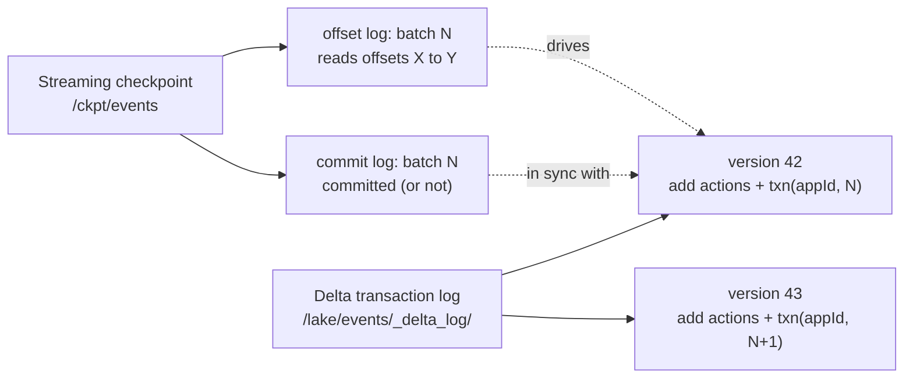

# Delta Lake as a Streaming Sink — How the `_delta_log` Closes the Chain

> **Tier 1 · Concept 4.5 — Interlude**
> Delta is the default streaming sink on Databricks and
> we examine the exact mechanism by which Delta closes the
> exactly-once chain — and the subtle hole that `foreachBatch` re-opens.

---

## The one-sentence idea

Delta achieves exactly-once on streaming writes by atomically recording a
`txn` action of `(appId, batchId)` in the transaction log alongside the
data. On retry, the Delta sink scans for that marker and skips the write
if it finds it — closing the third leg of the chain with zero application
code, **provided you stay on the streaming write path**. `foreachBatch`
drops you onto the batch Delta API, which does *not* carry that context
by default.

---

## Delta is a first-class streaming sink

On Databricks (and anywhere with `delta-spark` on the classpath), Delta
is a first-class streaming sink and source. The simplest form needs no
`foreachBatch` at all:

```scala
events.writeStream
  .format("delta")
  .outputMode("append")
  .option("checkpointLocation", "/ckpt/events")
  .option("path", "/lake/events")
  .start()
```

This is **already exactly-once** end-to-end (given a replayable source).
No `MERGE`, no manual `batchId` logic. The reason is that Delta has built
`batchId` awareness directly into its transaction log.

The `foreachBatch` + `MERGE` pattern from Concept 4 becomes necessary
only when you need **upserts** — updating existing rows by key — which
append-only `writeStream` does not support. Decision tree:

- **Append-only events** (immutable facts, raw event ingest) →
  `format("delta")` directly. Exactly-once for free.
- **Upserts / current-state tables** (CDC, dimensions, latest-value
  per key) → `foreachBatch` with `MERGE`.

Both close the exactly-once chain. They use *the same underlying
mechanism* in the `_delta_log`, just exposed at different API levels.

---

## The two logs at play

Two log layers coexist and must stay in sync:

1. **Spark's streaming checkpoint** at `/ckpt/events`. Holds the offset
   log and commit log for the streaming query. Indexes things by
   `batchId`.
2. **Delta's transaction log** at `/lake/events/_delta_log/`. Holds the
   table's versioned history. Indexes things by `version` (a
   monotonically increasing integer: `0`, `1`, `2`, …).

These two logs live in different places and use different IDs. The
question is: how does the Delta sink ensure that batch N from the
streaming engine gets committed exactly once to the Delta table, even
on retry?

The answer is the **`txn` action** — the transactional identifier —
written into the Delta log as part of every streaming commit.

---

## What gets written to `_delta_log`

Every Delta commit is a JSON file:
`_delta_log/00000000000000000017.json` for version 17, and so on. Each
file contains a sequence of *actions* — atomic facts about what
changed. The action types relevant to streaming:

| Action       | What it records                                                   |
| ------------ | ----------------------------------------------------------------- |
| `commitInfo` | Metadata: timestamp, operation type, user, cluster info           |
| `add`        | A new data file added to the table (Parquet path + statistics)    |
| `remove`     | A data file tombstoned (no longer part of the table)              |
| `metaData`   | Schema, partition columns, table properties (written on changes)  |
| **`txn`**    | **Transactional idempotency marker: `(appId, version)`**          |

The `txn` action is the one that closes the exactly-once chain. Its
structure:

```json
{
  "txn": {
    "appId": "spark-streaming-query-events-uuid-abc123",
    "version": 17,
    "lastUpdated": 1730000000000
  }
}
```

- `appId` is a stable identifier for the streaming query — derived from
  the query's id and the sink. Stable across restarts.
- `version` here is **Spark's `batchId`**, not the Delta table version.
  The naming is unfortunate: two different "version" numbers live in
  the same log file.

---

## The lifecycle: normal commit, then crash + retry

### Normal commit of batch N

1. The engine collects the records produced by batch N.
2. The Delta sink begins a Delta transaction (optimistic concurrency
   control on the transaction log).
3. The sink writes the data files (`add` actions) and the `txn` action
   `(appId, batchId=N)` together.
4. The transaction commits atomically as a new version of the Delta
   table — say, version 42. The file
   `_delta_log/00000000000000000042.json` appears, containing both
   the `add` actions and the `txn` action.
5. The streaming engine records batch N as committed in its own commit
   log.

Atomicity here is the Delta protocol's job. Either the whole
`_delta_log/…000042.json` file exists with all its actions, or it does
not. There is no partial Delta commit.

### Crash between step 4 and step 5

Delta committed version 42; Spark's commit log never recorded batch N
as done. On restart:

1. The engine reads its checkpoint and sees batch N as uncommitted. It
   replays batch N — same offset range from the source, same records.
2. The engine drives the Delta sink with batch N again, with
   `batchId = N`.
3. **Before writing, the Delta sink scans the `_delta_log` for any
   `txn` action with this `(appId, version=N)`.**
4. It finds the `txn` from version 42. It concludes: "batch N is
   already committed. Do nothing."
5. The sink returns successfully without writing anything. The
   engine's commit log records batch N as done.
6. The next trigger proceeds to batch N+1 normally.

That is the mechanism. The `txn` action is a self-describing marker
that says: *"this Delta version was created by streaming app `appId`,
batch `N`."* On replay, the sink checks: *"have I already seen
`(appId, N)`?"* If yes, skip. If no, write.

**Idempotency by `batchId`, written into the table's own log, with no
application code required.**

---

## The two logs in one picture



Each Spark `batchId` corresponds to *at most one* Delta version. On
retry, the Delta sink sees its own previous commit and refuses to make
another.

---

## Which Delta write paths get this idempotency?

This is the subtlest part. **Idempotency via `txn` action is a property
of the streaming Delta sink, not of `MERGE` specifically.** Any
streaming write through `format("delta")` writes the `txn` action —
including plain append. The mechanism is identical.

| API form                                                                 | `txn` action written? | Idempotent on retry? |
| ------------------------------------------------------------------------ | --------------------- | -------------------- |
| `writeStream.format("delta").outputMode("append")`                       | yes                   | yes                  |
| `writeStream.format("delta").outputMode("update")` (after aggregation)   | yes                   | yes                  |
| `writeStream.format("delta").outputMode("complete")` (after aggregation) | yes                   | yes                  |
| `foreachBatch { (df, batchId) => df.write.format("delta")... }`          | **no by default**     | **no by default**    |
| `foreachBatch { (df, batchId) => deltaTable.merge(df, ...).execute() }`  | **no by default**     | **no by default**    |

Notice the trap in the bottom two rows. **When you drop into
`foreachBatch`, you leave the streaming Delta sink behind.** Inside
the function, you are calling *batch* Delta APIs
(`df.write.format("delta")`, `deltaTable.merge`). Those batch APIs do
not know they are being invoked from a streaming context, and they do
not write `txn` actions.

So if you use `foreachBatch` for upserts and call `deltaTable.merge`
plainly, **you have re-opened the duplicate-write hole** that the
streaming Delta sink would have closed for you. On retry, `MERGE` runs
again. Because `MERGE` is keyed on a domain key (`event_id`), the
*data outcome* is still correct — duplicate records are absorbed by
the merge's `whenMatched` clause. But you have lost the `txn`-level
idempotency guarantee, and you are back to relying on application-level
dedup.

For most upsert patterns this is fine — `MERGE` on a domain key is
naturally idempotent at the data level. The exception is when the
merge is *not* purely idempotent — e.g. running accumulation:

```scala
.whenMatched.update(Map("count" -> $"t.count" + $"s.count"))
```

On retry, the count increments twice. The merge-on-key alone cannot
save you because the operation itself is not idempotent.

---

## Re-attaching `txn` idempotency inside `foreachBatch`

Delta exposes the `txn` mechanism directly via two write options:

```scala
events.writeStream.foreachBatch { (df: Dataset[Row], batchId: Long) =>
  df.write
    .format("delta")
    .mode("append")
    .option("txnVersion", batchId)
    .option("txnAppId", "events-upsert-app")
    .save("/lake/events")
}
```

The `txnVersion` + `txnAppId` options instruct the Delta writer to emit
a `txn` action with that identity, **and to skip the write if a
matching `txn` is already in the log**. This restores the same
idempotency the streaming Delta sink provides automatically.

For `MERGE` specifically, the equivalent involves the Delta
`transactionVersion`/`transactionAppId` API on the merge builder
(Delta 2.0+). Most teams rely on the natural idempotency of
`MERGE`-on-a-domain-key and do not bother. The exception, as noted,
is non-idempotent merge operations like running accumulations, where
you *must* use the `txn` mechanism or the count will be wrong on
every retry.

---

## The practical decision tree

```
Are you writing immutable events (append-only)?
├─ Yes → writeStream.format("delta").outputMode("append")
│         [exactly-once free; no foreachBatch needed]
│
└─ No, you need upserts / current-state semantics
   │
   Is the MERGE operation naturally idempotent on a domain key?
   (whenMatched.updateAll, whenNotMatched.insertAll — values overwrite)
   ├─ Yes → foreachBatch + plain MERGE on event_id
   │         [data-level idempotent; sufficient for most use cases]
   │
   └─ No, the MERGE accumulates state
      (whenMatched.update("count = count + 1") or similar)
      └─ foreachBatch + MERGE with txnVersion/txnAppId
           [Delta-protocol idempotent; required for correctness]
```

---

## The senior-signal framing

When asked "how does Delta achieve exactly-once with streaming?", the
surface answer is "transactional writes." The senior answer:

> Delta writes a `txn` action containing `(appId, batchId)` atomically
> with the data into the transaction log. On retry, the Delta sink
> scans the log for that `(appId, batchId)` and skips the write if it
> finds it. This means *append* writes are exactly-once with no
> application code. `foreachBatch` re-opens that hole because batch
> Delta APIs do not carry the streaming context — for non-idempotent
> merge operations you have to re-establish it with `txnVersion` /
> `txnAppId`. For naturally idempotent merges on a domain key, the data
> outcome is correct without it, but you have moved the dedup guarantee
> from the protocol layer to the application's key choice.

That answer demonstrates: you know the mechanism (the `txn` action),
you know the failure mode (`foreachBatch` strips streaming context),
and you know when each pattern is sufficient.

---

## Spark 3.x / Delta version notes

- The `txn` action and the streaming-sink idempotency mechanism have
  been in Delta since the early 1.x releases — no version gap on the
  core mechanism between Spark 3.x and 4.x.
- The `txnVersion` / `txnAppId` write options are Delta 2.0+. Databricks
  Free Edition runs current Delta, so this is available.
- Delta 3.x adds `whenNotMatchedBySource` to `MERGE` (useful for SCD2 /
  full-snapshot-style upserts) and deletion vectors (logical deletes
  without rewriting files). Neither changes the idempotency mechanism;
  both are independent improvements layered on top.

---

## Prove you got it

1. **The two logs.** A teammate asks: "if Spark's commit log already
   records that batch N is done, why does Delta need its own `txn`
   action? Isn't that redundant?" Answer in two or three sentences,
   focusing on the failure window where the redundancy actually pays
   off.
2. **The `foreachBatch` hole.** You build a streaming pipeline that
   reads from Kafka and writes to a Delta table via
   `foreachBatch { (df, batchId) => deltaTable.merge(df, "t.id = s.id")
   .whenMatched.update(Map("count" -> $"t.count" + $"s.count"))
   .whenNotMatched.insert(...).execute() }`. The Kafka source is
   replayable and the checkpoint is configured correctly. On a crash
   between Delta commit and Spark's commit-log write, what happens to
   the counts on restart, and what is the minimum fix?
3. **The decision tree.** For each of the following, pick the right
   write path (plain `format("delta")`, `foreachBatch` + plain
   `MERGE`, or `foreachBatch` + `MERGE` with `txnVersion` /
   `txnAppId`) and justify in one line:
   (a) Ingesting raw clickstream events into a bronze table.
   (b) Maintaining a `customers` dimension table updated from a CDC
   feed via `MERGE` on `customer_id`, with `whenMatched.updateAll`.
   (c) Maintaining a per-user running total of order amounts, updated
   via `MERGE` on `user_id` with
   `whenMatched.update("total = total + new_amount")`.

<details>
<summary>Answers</summary>

1. The redundancy pays off in the narrow failure window between Delta
   committing version N and Spark writing its own commit-log entry for
   batch N. If the engine crashes in that window, on restart Spark
   sees batch N as uncommitted and replays it; without the `txn`
   action in the Delta log, the Delta sink would happily commit the
   same data a second time as version N+1, producing duplicates. The
   `txn` is how Delta — by itself, with no help from Spark's
   checkpoint — recognises "I already committed this `batchId`" and
   refuses the duplicate write.
2. The counts double on restart. The crash happened between Delta
   committing version 42 (with batch N's increments applied) and
   Spark writing batch N to its commit log; on restart Spark replays
   batch N. Because `foreachBatch` invokes the *batch* Delta API,
   no `txn` action was written, so the Delta sink has no record that
   batch N was already applied. The `MERGE` runs again and the
   `whenMatched.update("count = count + new_amount")` clause
   increments every matched row a second time. The minimum fix is to
   use the merge-builder equivalent of `txnVersion` / `txnAppId`
   (Delta 2.0+) so that the second invocation finds the existing
   `txn(appId, N)` in the log and skips the write entirely.
3. (a) Plain `writeStream.format("delta").outputMode("append")`. Raw
   immutable events; the streaming Delta sink writes `txn` actions
   automatically; no merge needed.
   (b) `foreachBatch` + plain `MERGE`. The merge is naturally
   idempotent on `customer_id` because `whenMatched.updateAll` simply
   overwrites with the same values on retry; no `txn` needed for
   correctness.
   (c) `foreachBatch` + `MERGE` with `txnVersion` / `txnAppId`. The
   update is accumulative (`total + new_amount`), so it is *not*
   idempotent at the data layer — a second application increments
   twice. The `txn` mechanism is required to make the Delta commit
   itself idempotent.

</details>

---

[← Tier 1 index](./README.md) · [Previous: Sinks & `foreachBatch` ←](./04-sinks-and-foreachbatch.md) · [Next: Output Modes →](./05-output-modes.md)