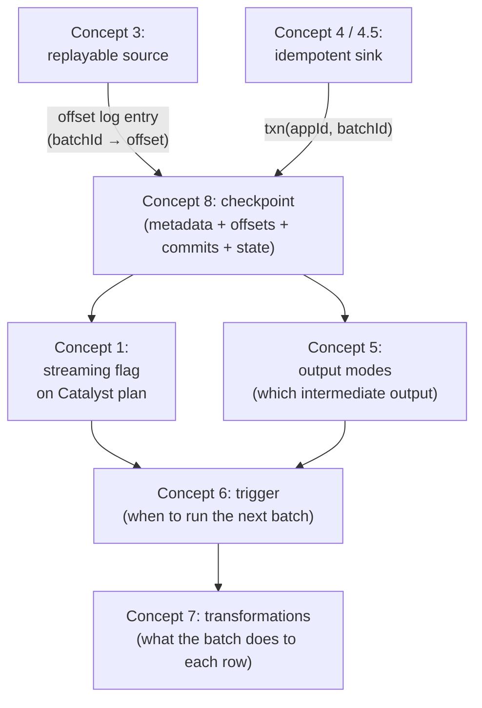

# Checkpointing Basics

> **Tier 1 · Concept 8 of 8**
> The final concept of Tier 1, and the one that ties everything together.
> Throughout the tier we've been treating "the checkpoint" as a black box.
> Now we open it. Every leg of the streaming machinery — sources, sinks,
> output modes, triggers, transformations — relies on the checkpoint as
> a shared substrate. Its design only makes sense once you know what it's
> coordinating.

---

## The one-sentence idea

A checkpoint is a directory on durable storage that records exactly
what the streaming engine needs to resume the query correctly after
a crash — query identity, planned offsets, completed batches, source
metadata, and operator state. Knowing what it stores, what survives
across runs, and what doesn't, is the operational backbone of
production streaming work.

---

## What a checkpoint actually is

A checkpoint is a directory on durable storage. Spark writes to it
during query execution; it reads from it on restart. The location is
configured via `option("checkpointLocation", "/path/...")` on
`writeStream`.

Inside, it looks roughly like this:

```
/path/to/checkpoint/
├── metadata               ← query identity (queryId)
├── offsets/               ← offset log: one file per planned batch
│   ├── 0
│   ├── 1
│   └── 2
├── commits/               ← commit log: one file per completed batch
│   ├── 0
│   └── 1                  ← (note: no commits/2 yet — batch 2 in flight)
├── sources/               ← source-side metadata (per source)
│   └── 0/
└── state/                 ← state store snapshots (only for stateful queries)
    └── 0/                 ← (operator id 0)
        └── 0/             ← (partition 0)
```

Five things, each with a specific job.

---

## The five components

### 1. Query identity — `metadata`

A single file containing the `queryId` (a UUID) and the query's name.
Written on first start, read on subsequent starts.

The queryId is *generated* on first start, *persisted* in this file,
and reused on every subsequent run that points at the same checkpoint
location. It's derived *from* the checkpoint, not from the query's
structure.

This is the file that makes "is this a restart of the same query?"
answerable. The Delta sink's `txn` action's `appId` is derived from
this identity, which is why Delta-side idempotency (Concept 4.5)
survives Spark restarts.

### 2. Offset log — `offsets/<batchId>`

One file per **planned** batch. Written *before* the batch executes.
Records what input range the engine intends to process.

Format depends on the source:

- Rate source: a single integer (elapsed seconds).
- Kafka: a JSON object mapping `(topic, partition) → endOffset` (see
  "Reading a Kafka offset log entry" below).
- File source: a list of file paths seen up to that batch.

#### Reading a Kafka offset log entry

A real `offsets/N` file from a Kafka-sourced streaming query has a
three-line structure. The third line is the source-specific payload.
Here's an example payload from a query subscribed to two topics:

```json
{
  "another-sensor-events": {"0": 900},
  "sensor-events":         {"0": 14640}
}
```

The structure is `{ "<topic-name>": { "<partition-id>": <offset> } }`.
Decoded:

- `another-sensor-events` → Kafka topic name.
- `0` → partition 0 within that topic.
- `900` → the offset Spark will resume from for this partition in the
  next micro-batch.

The crucial detail: **the recorded value is the next offset to read,
which is also the exclusive end of what this batch consumed.** It is
*not* "the last offset consumed." This convention is used by Kafka
itself for consumer offsets and by Spark for the offset log.

Concretely for the example above:

- Offsets `0` through `899` of `another-sensor-events` partition 0
  have been processed by batches up to and including this one (900
  records).
- The next micro-batch will begin reading from offset `900`.

The same convention applies to `sensor-events`. If the previous
batch's offset log recorded `14400`, this batch consumed offsets
`14400` through `14639` (240 records) — and the next batch will
start at `14640`.

Why this convention? It maps cleanly to "where to resume on restart."
On startup, Spark reads the highest `offsets/N` file, gets the
recorded value, and asks Kafka *"give me records starting from this
offset."* No off-by-one logic required — the recorded value *is* the
resume position. This is the same convention as Scala's `slice(from,
until)`: `until` is the next position, not the last position.

A practical consequence: you can read the per-batch workload directly
by diffing two consecutive offset-log files. If batch 12 records
`14400` and batch 13 records `14640`, batch 13 consumed exactly 240
records from that topic-partition.

**Protects against data loss.** On restart, the engine reads the
highest `offsets/N` file to know exactly where to resume reading
the source. If a crash interrupted batch N before commit, batch N
is replayed from the same offset range.

### 3. Commit log — `commits/<batchId>`

One file per **completed** batch. Written *after* the sink write
succeeds.

Format: mostly empty — a version marker and a few housekeeping
fields. The *presence* of the file is the signal: "batch N is
durably done."

**Protects against duplication.** On restart, the engine
cross-references `offsets/N` against `commits/N`:

- Both exist → batch N is fully done; advance to N+1.
- `offsets/N` exists, `commits/N` doesn't → batch N was planned but
  never confirmed complete; replay it.

The asymmetry between these two directories is the visible
crash-window signature.

### 4. Source metadata — `sources/<sourceId>/`

Source-specific bookkeeping distinct from offsets. Examples:

- For the file source: a manifest of files already seen, used to
  dedupe across batches (so a file isn't re-read if its modification
  time crosses a batch boundary).
- For Kafka: a small metadata cache for the consumer's bootstrapping
  state.

Most demos don't engage this directory meaningfully. It's there for
sources that need bookkeeping beyond offsets.

### 5. State store — `state/<operatorId>/<partitionId>/`

For stateful queries only. Contains incremental snapshots of the
state for each stateful operator (`groupBy`, `dropDuplicates`,
stream-stream join, etc.), organised by **operator position in the
query plan** and **shuffle partition**.

Two things to know now:

1. **The state schema is recorded** as part of the snapshots. On
   restart, the engine verifies the new query's stateful operators
   match the recorded schema. Mismatches refuse to start.

2. **The number of shuffle partitions is fixed at checkpoint
   creation.** `spark.sql.shuffle.partitions` becomes immutable for
   the lifetime of the checkpoint. Changing it on a re-run is
   silently ignored; the query continues using the original partition
   count. To apply a new partition count, start with a new
   checkpoint location.

This is one of those design choices that bites people in production.

---

## What survives across runs and what doesn't

Three categories. The boundaries between them are operationally
critical.

### Safe to change between runs (same checkpoint)

These properties of the query don't change what's physically stored
in the checkpoint, so changing them on a re-run is safe:

- **Trigger type and interval** — `ProcessingTime` ↔ `AvailableNow`
  ↔ default. Concept 6 covered this directly.
- **`maxOffsetsPerTrigger`, `maxFilesPerTrigger`** — pacing knobs,
  not structural.
- **Cluster config** — executor count, memory, log level, driver
  size.
- **Trivial pass-through transformations on stateless code paths**
  — adding a `select` of existing columns, renaming for readability.
- **Sink-side options that don't change the contract** — adjusting
  batch sizes for a JDBC sink, for instance.

### Refused at restart (loud failure)

These changes the planner detects and rejects with an exception.
You cannot start the query against the existing checkpoint:

- **Adding, removing, or reordering streaming sources** — source
  identity is bound to its *position* in the query plan.
- **Adding, removing, or changing stateful operators** — the state
  schema recorded in `state/` won't match the new operator
  structure.
- **Changing the output mode** — `append` ↔ `update` ↔ `complete`
  change what the engine produces per batch.
- **Changing the streaming source's schema in incompatible ways** —
  fields removed, types changed.

In all these cases, Spark fails loud and forces you to either start
with a new checkpoint location (and lose all prior state) or revert
the change.

### Silently dangerous

This is the category to be most paranoid about. These changes are
not detected by Spark but produce wrong results or silently fail to
take effect:

- **Renaming the Kafka topic.** Removing the old topic from
  `subscribe` and adding a new one is a remove-plus-add. The old
  topic's offset entries become orphan (ignored, never re-read).
  The new topic, treated as "newly discovered," starts from
  earliest of the *new* topic's broker-side log — which, if it's a
  freshly-created topic post-rename, may contain no historical data
  at all. Data on the old topic between the last commit and the
  rename is silently lost.

- **Using `subscribePattern` with a regex that changes which topics
  match.** Spark continuously re-evaluates the pattern. Topics
  matching after restart are treated as newly-discovered (start
  from earliest); topics that no longer match are removed from the
  offset log on subsequent batches. Pattern-based subscriptions are
  fragile in this regard — the active topic set can shift without
  any code change, just from broker-side topic creations or
  deletions matching the pattern.

- **Changing `spark.sql.shuffle.partitions` on a stateful query.**
  The new value is silently ignored; the old value (locked at
  checkpoint creation) continues in force. No correctness bug — but
  no performance change either, despite your intent. You can spend
  hours debugging why your tuning isn't taking effect, because
  nothing in the logs explicitly says "I'm ignoring your setting."

- **Changing the semantics of a stateless transformation upstream of
  a stateful operator.** Modifying a `withColumn` upstream of a
  `groupBy` can change the aggregation's results without invalidating
  the state schema — so old state (computed under the old
  transformation) and new state (computed under the new one) coexist
  in subtle ways.

### Safe-but-surprising: adding a topic to an existing source

Worth its own callout because the surface appearance ("you changed
the subscribe option") suggests danger, but the actual behaviour is
benign — and empirically verifiable.

If you add a topic to the `subscribe` option on an existing Kafka
source and restart against the same checkpoint:

- Existing topics resume from their recorded offsets in the offset
  log.
- The newly-added topic is treated as a "newly discovered partition"
  and **starts from earliest** — Spark's documented behaviour for
  this case is *"newly discovered partitions during a query will
  start at earliest."*
- No data is skipped on either side. The new topic is backfilled
  from the beginning of its broker-side retention window.

This is genuinely safe, not silently dangerous. Removing or
renaming topics is where the danger lives; pure addition is fine.

The pattern:

- **Safe changes** are runtime-loop changes (trigger, pacing, cluster
  config).
- **Loud-failure changes** are structural changes the planner can
  detect (operator shape, output mode, source count).
- **Silently dangerous changes** are semantic changes that *look*
  equivalent to the planner but aren't.

The silent category is the dangerous one because there are no logs,
no exceptions, and no obvious symptoms — just wrong results or
ineffective tuning.

---

## The operational rule

> **A new logical query gets a new checkpoint location.**

Even when the change *might* be safe, defaulting to a new path is the
safer move. Storage is cheap; debugging silent state corruption is
expensive.

A practical pattern many teams use: encode the checkpoint version in
the path.

```scala
val checkpointVersion = "v3"
val checkpointPath = s"/lake/checkpoints/$queryName/$checkpointVersion"
```

When you make a structural change, bump the version. The old
checkpoint becomes orphan data (you can delete it after verifying
the new query is healthy), the new query starts fresh, and a future
bisect-by-checkpoint-version can recover the old behaviour if needed.

For very high-stakes pipelines, the version bump might trigger an
explicit catchup phase: deploy `v3` with `AvailableNow` and
`startingOffsets = earliest` (or a specific committed offset from
`v2`'s offset log), let it backfill, then switch to steady-state.

---

## State migration: the senior-DE responsibility

The operational rule says "new logical query, new checkpoint location."
That's correct, but it has a real cost: **a new checkpoint means you
lose all the aggregated state accumulated so far.** If the query has
been running for three months computing user-level counts, throwing
away that state means the new query starts at zero, missing three
months of pre-restart data.

For schema changes (e.g. adding a new field to an aggregation key —
`groupBy("user_id")` → `groupBy("user_id", "country")`), there are
three legitimate approaches, each with different trade-offs:

### Approach 1: Accept the reset, backfill from source

Bump the checkpoint version, set the source's `startingOffsets =
earliest` (or to a known committed offset), let `AvailableNow`
re-process the entire history into the new query shape, then switch
to steady-state.

- **Works when:** the source has full history available.
- **Fails when:** Kafka retention is shorter than the historical
  window you need. Twelve hours of retention can't backfill three
  months of state.

### Approach 2: Externalise the state, migrate the schema, restart

Before deploying:

1. Write the current aggregation state to a Delta table via
   `foreachBatch` (or query the existing state via Spark 4's State
   Data Source reader).
2. Stop the streaming query.
3. Run a batch job that reads the externalised state and restructures
   it from `(user_id) → count` to `(user_id, country) → count`. For
   the new column, either backfill `country` from a dimension table
   join, or set `country = unknown` for legacy rows.
4. Start the new streaming query against a fresh checkpoint, with
   the migrated state externalised as a Delta target. New events
   update the externalised state via `MERGE`.

- **Works when:** the schema migration is computable from existing
  state (or from existing state plus a dimension lookup).
- **Most flexible** of the three; requires a batch-job hop.

### Approach 3: Run both queries in parallel during cutover

Keep the old query running against its checkpoint with the old
schema. Start a new query against a fresh checkpoint with the new
schema, configured with `startingOffsets = earliest` (or whatever
covers the desired backfill). When the new query has caught up to
"now," cut consumers over to it and decommission the old one.

- **Works when:** zero downtime is required.
- **Highest cost:** double compute during the cutover window.

### Picking the right approach

Each approach has prerequisites that span multiple tiers of this
material. Knowing the cross-tier dependencies helps clarify which
approach you can actually execute at any given point:

- **Is source retention long enough?** Approach 1 needs the source's
  retention to cover the full historical window the aggregation
  represents. If Kafka has 7 days and the aggregation has 3 months
  of history, Approach 1 is impossible without an external source
  of history.
- **Can you read the existing state out of the old checkpoint?**
  Approach 2 needs a way to extract the current state into a
  DataFrame. The clean way is **Spark 4's State Data Source reader**
  (`spark.read.format("statestore")`), which is Tier 4 territory.
  Workarounds via `foreachBatch` exist but are fragile.
- **Can you decide when the new query has "caught up"?** Approach 3
  needs a precise notion of "the new query's progress has reached
  the old query's stopping point," which depends on **watermarks**
  (Tier 2). Without watermarks, the cutover decision is
  eyeballed — fine for low-stakes work, dangerous for SLA-bound
  pipelines.
- **Is downtime acceptable?** Approach 3 is the only zero-downtime
  path.
- **Can the new key be derived from existing data?** Approach 2 is
  feasible only if every row has (or can be enriched with) the new
  column's value.

The discipline takeaway: **a schema migration is not just a code
change. It's a state migration, and it needs a plan.** "Use the same
checkpoint" is the wrong instinct; "use a new checkpoint and migrate
the state deliberately" is the senior-DE response.

### Deferred: end-to-end state migration demo

A worked example of Approach 2 — extract existing state with the
State Data Source reader, apply a key-set change in a batch job,
restart streaming against the migrated state — belongs alongside
the state store internals it depends on. The State Data Source
reader is the load-bearing primitive, and it lives in Tier 4. The
demo will be built there with the right tools in hand, rather than
forced now with workarounds.

This is an example of the scope discipline applied throughout these
notes: a demo that would conflate concepts from different tiers is
deferred rather than forced. When we cover state store internals in
Tier 4, we will build the migration demo end-to-end, against the
specific case of adding a key column to an existing `groupBy`
aggregation.

---

## Checkpoint location is a first-class design decision

Three things to think about when choosing a checkpoint location for
a production pipeline:

### 1. Durability and atomicity guarantees of the underlying filesystem

The checkpoint relies on the underlying storage providing atomic file
creation. From the Apache Spark documentation:

> "Note that this needs to be a HDFS-compatible fault-tolerant file system, otherwise the streaming query won't restart correctly."

S3 has eventual consistency for listing operations historically
(strong consistency from December 2020); ADLS Gen2 is strongly
consistent; HDFS is strongly consistent. For Delta-on-S3 specifically,
the Delta protocol layered on top adds the atomicity that vanilla S3
lacks for transactions — but the *checkpoint* is a different concern.
Spark's checkpoint format expects atomic file creation.

Practical implication: use the same storage layer your data lives on
(Delta on S3 → checkpoint on S3 with appropriate consistency
guarantees), and verify your storage's guarantees if you're targeting
something unusual.

### 2. Lifecycle co-location with the table

Put the checkpoint *inside* the table directory at
`<tablePath>/_checkpoint`. Reasons:

- The checkpoint *belongs to* the table — it tracks the streaming
  write into it. Co-located lifecycle: drop the table, drop its
  checkpoint.
- The `_` prefix is the Hadoop/Delta convention for metadata
  directories. Spark's file listings ignore directories starting
  with `_` or `.` when scanning for data, so the checkpoint is
  invisible to readers.
- One filesystem prefix per table = clean backups, migrations,
  copies.

### 3. Cost of checkpoint writes

Each batch writes to the checkpoint. For a query running
`ProcessingTime("1s")`, that's a write per second to the storage
layer. On cloud storage, this is a per-request cost.

Two mitigations:

- Choose a sensible trigger interval (Concept 6).
- For very high-volume stateful queries, use the **RocksDB state
  store** (Tier 4 territory). It writes state changes incrementally
  to local disk, then periodically uploads compacted snapshots to
  durable storage — fewer cloud-storage requests at the cost of more
  local-disk activity.

---

## The whole tier in one picture

We've now seen every leg of the streaming machinery. The checkpoint
is what coordinates them:



Every concept in Tier 1 is anchored by the checkpoint. That's why
we covered it last: only now can you see *all* the things it has
to coordinate.

---

## Spark 3.x → 4.x note

The checkpoint format is stable across Spark 3.x and 4.x —
checkpoints written by 3.x can be resumed by 4.x in most cases. The
state store internals have evolved (RocksDB state store became more
featured, changelog checkpointing was added in 3.4+), but the
checkpoint directory's outer structure
(`metadata`/`offsets`/`commits`/`sources`/`state`) is unchanged.

One Spark 4.0 addition worth flagging: the **State Data Source
reader**, which lets you read the contents of a checkpoint's `state/`
directory as an ordinary batch DataFrame. This is hugely useful for
debugging "why is my state wrong" and for asserting on state in
tests. Tier 4 covers it properly.

---

## Prove you got it

1. **The five components, classified.** For each scenario, name which
   component (`metadata`, `offsets/`, `commits/`, `sources/`, `state/`)
   is involved, and what specifically would go wrong if that
   component were missing or corrupted:
    - (a) The engine needs to know whether batch 17 was successfully
      written to the sink before the JVM died.
    - (b) The Delta sink's `txn` action carries an `appId` that's the
      same on every commit by this query, across restarts.
    - (c) A `groupBy().count()` query restarts and resumes counting
      from where it left off rather than from zero.
    - (d) After restart, the engine knows exactly which file offsets
      to ask Kafka for.
2. **Three categories of change.** Classify each as **safe to make
   with the same checkpoint**, **refused at restart (loud failure)**,
   or **silently dangerous (wrong results or silently ineffective)**.
   Justify each in one sentence:
    - (a) Changing trigger from `ProcessingTime("10s")` to
      `AvailableNow`.
    - (b) Adding a second Kafka topic to the `subscribe` option.
    - (c) Renaming the Kafka topic the query subscribes to.
    - (d) Changing `spark.sql.shuffle.partitions` from 200 to 50 on a
      `groupBy` query.
    - (e) Adding a `withColumn("foo", lit(1))` to a stateless pipeline.
3. **The discipline question.** A teammate is about to deploy a
   change that adds a new field to an aggregation key — going from
   `groupBy("user_id")` to `groupBy("user_id", "country")`. They
   plan to deploy against the existing checkpoint to "preserve the
   state we've accumulated." Walk them through what will happen and
   what they should do instead, including how to preserve historical
   aggregates if that matters.

<details>
<summary>Answers</summary>

1. (a) **`commits/`**. The presence of `commits/17` is the engine's
   record that batch 17 is durably done. Its absence (with
   `offsets/17` present) means batch 17 was planned but not
   confirmed, and the engine will replay it on restart. If `commits/`
   were missing or corrupted, the engine would either replay
   already-committed batches (potential duplicates without
   sink-side idempotency) or skip uncommitted work.
   (b) **`metadata`**. The `queryId` recorded there is what gives
   the Delta sink a stable `appId` across restarts. Corruption or
   loss of this file generates a new `queryId` on restart, the
   Delta sink emits `txn` actions with a *new* `appId`, and the
   `(appId, batchId)` idempotency check no longer matches — leading
   to duplicate writes of any batch that committed to Delta before
   the crash but not to Spark's commit log.
   (c) **`state/`**. The running counts per group live in the state
   store, organised by operator position and shuffle partition.
   Missing `state/` while `offsets/` and `commits/` are present
   causes the engine to refuse to start: the new query has stateful
   operators but no recorded state, a mismatch. (To genuinely
   restart from zero, delete the *entire* checkpoint, not just
   `state/`.) Corruption that changes the recorded state schema
   causes the same refusal.
   (d) **`offsets/`**. The Kafka offset ranges per batch live here.
   Without it, the engine has no way to know where to resume from,
   so the source either starts from `startingOffsets` (silent data
   loss for records arriving before the restart) or fails to start.
   The exactly-once chain breaks at the source leg.
2. (a) **Safe.** Trigger is a runtime-loop setting, not a structural
   part of the query plan; checkpoint metadata is indifferent to
   trigger choice.
   (b) **Safe-but-surprising.** Spark adds the new topic to the same
   Kafka source's bookkeeping and resumes existing topics from their
   recorded offsets. The new topic is treated as a "newly discovered
   partition" and starts from earliest — *not* from the
   `startingOffsets` config. This is the documented behaviour and is
   safe; the only surprise is that the new topic gets a full
   backfill from its broker-side retention window rather than
   starting fresh from the current head.
   (c) **Silently dangerous.** A rename is a remove-plus-add. The
   old topic's offset entries become orphan; the new topic starts
   from earliest of *its* broker-side log, which post-rename may
   contain no historical data. Data on the old topic between the
   last commit and the rename is silently lost. New topic = new
   checkpoint, or at minimum a deliberate migration plan.
   (d) **Silently dangerous (silently ineffective).** The shuffle
   partition count is locked at checkpoint creation. The new value
   is ignored; the query continues using the original count. No
   correctness bug, but the tuning has no effect — and nothing in
   the logs says so. Debugging "why didn't my partition change take
   effect" is exactly this trap.
   (e) **Safe.** Adding a stateless transformation to a stateless
   pipeline doesn't change the source identity, state schema, or
   output mode; the checkpoint metadata is unaffected.
3. Adding `country` to the aggregation key changes the state
   operator's structure, which means the state schema recorded in
   `state/` no longer matches what the new query needs. The
   engine will **refuse to start** (loud failure) — a state schema
   mismatch exception at `start()`. So the teammate's plan won't
   "preserve the state we've accumulated" anyway; it will fail
   loud at deploy time.

   The right move is a **state migration**, with three viable
   approaches depending on the situation:
    - **Approach 1 — backfill from source.** Bump the checkpoint
      version, set `startingOffsets = earliest`, run with
      `AvailableNow` to backfill the full history into the new
      query shape, then switch to steady-state. Works only if the
      source's retention covers the historical window.
    - **Approach 2 — externalise, migrate, restart.** Before
      deploying, write the current state to a Delta table via
      `foreachBatch` (or read it via Spark 4's State Data Source
      reader). Run a batch job that restructures the state to add
      the `country` column (either backfilling from a dimension
      table or defaulting to `unknown` for legacy rows). Start the
      new streaming query against a fresh checkpoint, with the
      migrated state externalised as a Delta target maintained by
      `MERGE`.
    - **Approach 3 — parallel cutover.** Keep the old query running.
      Start a new query against a fresh checkpoint with the new
      schema, configured to backfill from earliest. When the new
      query has caught up to "now," cut consumers over and
      decommission the old query. Zero downtime; double compute
      during cutover.

   The discipline takeaway: schema changes to stateful queries are
   state migrations, not just code changes. The teammate's
   instinct to preserve state was correct; the implementation
   ("same checkpoint") was wrong; the answer is "new checkpoint
   plus a deliberate state-migration plan."

</details>

---

[← Tier 1 index](./README.md) · [Previous: Stateless Transformations ←](./07-stateless-transformations.md)

---

**This completes Tier 1.** From here, Tier 2 introduces event time,
watermarks, and stateful operators — the level at which true streaming
power and complexity live. Concept 8 has equipped you with the
operational mental model you'll need before going there.