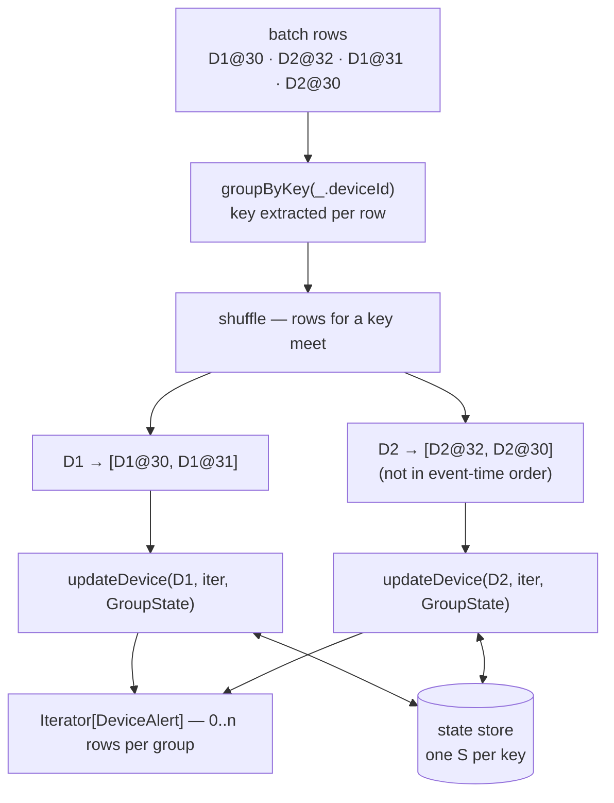

# Arbitrary Stateful Processing (legacy) — Part 1

> **Tier 2 · Concept 6 of 7**
> Aggregation, join, and dedup are all "keyed state + update function + eviction"
> with the update function and the eviction rule chosen for you. Here you write
> both. Part 1 covers arbitrary state; Part 2 covers timeouts.

---

## The gap

Every operator so far is **driven by arriving rows**. State changes, and output
appears, only as a consequence of an input row for that key. That property is
invisible until you need a system that reacts to data **not** arriving.

**The requirement.** Devices emit a heartbeat every ~30s.

1. A device is DOWN if no heartbeat for 90 seconds of event time.
2. On going down, emit **one** alert per outage.
3. On recovery, emit one alert carrying the outage duration.
4. Roster is not known in advance.

```
D1:   hb    hb    hb                              hb
 t=   30    60    90 ─────── silence ─────────── 270
                   │              │                │
              last seen      DOWN at 180      RECOVERED
```

The first alert sits at `t=180` — **a point where there is no input row for D1
at all.**

### Why the existing operators can't do it

- **Windowed aggregation** (`groupBy(window, deviceId).count()`, alert on zero).
  A key enters state only when a row carrying it arrives, and the *window* half
  of the key is data-derived too — windows are instantiated by rows landing in
  them, not by the passage of time. A silent device instantiates nothing on
  either axis. **Absence is not zero; absence is nothing.**
- **`groupBy(deviceId).agg(max(eventTime))`.** Gives a correct last-seen table.
  Nobody compares it to the clock. For a dead device the row just stops changing;
  detecting the outage means polling from outside — the detection has left the
  stream.
- **Outer join.** The one place absence produced output (stream-stream: null-padded rows at
  eviction). But there a row *did* arrive and failed to find a partner. Here
  nothing arrives — there is no left row to pad.
- **Dedup.** Suppresses repeats of things that arrive; says nothing about things
  that don't.

### Two missing capabilities

**(A) Output must be a function of the state *transition*, not the state *value*.**
An aggregation's output *is* its accumulator, so every recomputation re-emits it —
requirement 2 ("one alert per outage") would fire every batch.

**(B) The engine must invoke you for a key that has no data.**
Detecting `t=180` requires something to run when D1 has contributed nothing.

They are orthogonal but co-dependent: (B) is useless without state to inspect,
(A) is insufficient for anything involving silence. That is why they ship as one
API. Part 1 is (A); Part 2 is (B).

**Level vs edge** — the anchor for all of this:

> A **level** is a function of the present. An **edge** is a function of the
> present *and* the past. Change is only visible against a remembered prior.

---

## What the engine must hand you

Derived before naming:

1. **Per-key storage surviving across batches.** A closure's locals die with the
   task. So: a handle to durable, checkpointed, engine-owned state, keyed by group.
2. **Invocation per key, with that key's new rows.** Requires a shuffle. Rows
   arrive as an `Iterator[V]`, not one at a time — one invocation must see the
   whole batch for that key, or the result depends on arrival order.
3. **Read, write, delete, and exists.** Delete needs its own justification:
   nothing else will ever remove this state. Exists distinguishes a new device
   from an existing one.
4. **Zero-to-many output rows.** A healthy heartbeat emits nothing; a recovery
   emits one. Zero is the common case, so "one row per key" would force a
   sentinel row and a downstream filter.

That is:

```scala
(key: K, newRows: Iterator[V], state: StateHandle[S]) => Iterator[U]
```

### The API

```scala
def flatMapGroupsWithState[S: Encoder, U: Encoder](
    outputMode: OutputMode,
    timeoutConf: GroupStateTimeout)(
    func: (K, Iterator[V], GroupState[S]) => Iterator[U]): Dataset[U]

def mapGroupsWithState[S: Encoder, U: Encoder](timeoutConf: GroupStateTimeout)(
    func: (K, Iterator[V], GroupState[S]) => U): Dataset[U]
```

`StateHandle[S]` is **`GroupState[S]`**: `exists`, `get`, `getOption`, `update`,
`remove`. [1]

`mapGroupsWithState` **cannot express this problem** —
it emits exactly one row per invoked key. It's the convenience form for
"current status per device", not "alerts".

Two rules from the trait [1]:
- **State cannot be `null`** — `update(null)` throws. Model absence with
  `remove()`/`exists`.
- After `remove()`, `exists` is `false` and `get` throws until the next `update`.

### Where the API lives

Both methods are on `KeyValueGroupedDataset` in `org.apache.spark.sql` — **not a
streaming-specific class**. The scaladoc states the split: for a static batch
Dataset the function is invoked **once per group**; for a streaming Dataset it is
invoked **for each group repeatedly in every trigger**, with state saved across
invocations. [1]

Batch–streaming unification again (Tier 1 C7): the streaming-ness comes from the
Dataset, not the operator. One consequence — streaming-only constraints
(watermark requirements, timeout legality) can't be caught by the compiler and
surface at **plan time** instead.

---

## Grouping and invocation

`groupByKey(_.deviceId)` applies the key function per row, producing a
`KeyValueGroupedDataset[String, Heartbeat]`. This is a *logical* construct — the
physical grouping happens at the shuffle.

Given a batch `D1@30, D2@32, D1@31, D2@30`:



D1 and D2 are present in this batch, so the function is invoked for each. A key
with state but no rows this batch is not invoked. [1]

D2's list is **not in event-time order** — the trait guarantees no ordering
within the iterator [1]. Reduce with something order-independent (`max`), never
"last row wins", or the output changes on replay.

---

## The encoder pause

`S: Encoder` is a **context bound** — sugar for an implicit parameter
`(implicit se: Encoder[S])` the compiler must satisfy at the call site.

Why it's required: `S` is **persisted to the state store**, checkpointed, and
restored after restart. The state store holds Tungsten binary rows, not Java
objects. `Encoder[S]` is the compile-time contract for that conversion. Same
notion as Tier 1's `Encoder[T]`, but here it governs the **durable on-disk format
of your state** — so changing the fields of `S` changes the persisted schema
(Tier 4: checkpoint evolution).

`import spark.implicits._` derives it for primitives, `String`, `Option`,
standard collections, and `Product` types.

### Probed: a sealed-trait ADT does NOT work as `S`

The domain-correct model makes illegal states unrepresentable:

```scala
sealed trait DeviceState
case class Active(lastSeen: Int)                  extends DeviceState
case class Down(lastSeen: Int, deemedDownAt: Int) extends DeviceState
```

On Spark 4.1.2 / Scala 2.13 this fails at **compile time**:

> Unable to find encoder for type `DeviceState`. … Primitive types (Int, String,
> etc) and **Product types (case classes)** are supported by importing
> `spark.implicits._`

A sealed trait is a **sum type**, not a `Product`, so derivation finds nothing.
The same failure hits `.toDS()` (which needs the encoder to apply its implicit
conversion) and the `[S, U]` bound on `flatMapGroupsWithState` — one cause, three
symptoms. `U` carries the same bound, so a sealed alert hierarchy fails too.

**The consequence:** you must flatten the sum into a product by hand — a
discriminator field plus nullable variant fields — and the invariant
("`deemedDownAt` is set exactly when down") drops out of the type and into your
discipline. Spark does not do that encoding for you.

This is the first concrete limitation: **`S` is one slot per key, whose type
system is narrower than Scala's.**

---

## Limitation: monolithic `S`

`GroupState[S]` gives **one slot per key**. Anything a key remembers is packed
into one object:

```scala
case class DeviceState(
  lastSeen:     Int,               // scalar, updated every batch
  status:       String,            // hand-rolled discriminator
  recentBeats:  List[Heartbeat],   // a growing list
  hourlyCounts: Map[Int, Int]      // a map
)
```

There is no partial read or write:

```scala
val prev = state.get                        // deserialize the ENTIRE object
state.update(prev.copy(lastSeen = maxT))    // serialize the ENTIRE object
```

That `copy` changes 4 bytes and rewrites the list and the map with it. So:

- **The cost of updating your cheapest field is set by the size of your largest.**
- You cannot read one field — reading `status` deserializes the whole blob.
- Eviction is all-or-nothing: `remove()` deletes everything for that key. "Expire
  the beats but keep the status" is impossible.
- It is invisible in `numRowsUpdated` — one row updated, whether 20 bytes or 200 KB.

C9's `transformWithState` replaces the one slot with independently-declared,
independently-serialized `ValueState` / `ListState` / `MapState`. [3]

---

## The demo — a naive first attempt

[`demos/tier2/HeartbeatNoTimeoutDemo.scala`](../../src/main/scala/demos/tier2/HeartbeatNoTimeoutDemo.scala) —
`GroupStateTimeout.NoTimeout`, threshold 90s, watermark 1s,
`noDataMicroBatches.enabled=false`.

State is just `DeviceState(lastSeen: Int)`. With both samples in hand in one
invocation — `prev.lastSeen` is the past, `maxT` the present — the edge is
computable **without** persisting a status:

```scala
case Some(prev) =>
  val silentFor = maxT - prev.lastSeen
  state.update(DeviceState(math.max(prev.lastSeen, maxT)))
  if (silentFor > DownThresholdSec) Iterator(alert(...)) else Iterator.empty
```

Three devices: **D1** goes silent then returns · **D2** healthy control, beats
every 30–60s · **D3** goes silent and never returns.

```
batch  input                inherited wm   total  upd  removed
  b0   D1@30, D2@30, D3@30       0           3     3      0
  b1   D1@60, D2@60, D3@60      29           3     3      0
  b2   D1@90, D3@90             59           3     2      0     last beat for D1, D3
  b3   D2@120                   89           3     1      0
  b4   D2@180                  119           3     1      0     <- 90s crossed. Nothing.
  b5   D2@210                  179           3     1      0
  b6   D2@240                  209           3     1      0
  b7   D1@270, D2@270          239           3     2      0     D1 RECOVERED
```

Sink: one row — `D1, RECOVERED, deemedDownAt=180, recoveredAt=270, silentFor=180`.

**`total − upd` is the count of uninvoked devices**, in every batch. In b3–b6 it
is 2 (D1 and D3).

**b4 is the batch to look at.** Inherited `wm=119`, D1 and D3 have been silent
90s, the threshold is crossed — and `upd=1`, sink empty. The engine is running,
the clock is past the boundary, and the two devices that crossed it are exactly
the two the function is never called for.

### `removed = 0`, always

In C4/C6/C7 eviction was a rule the engine **derived from the watermark promise**
and applied for you: `window.end <= wm`, `iT + interval < W`, `wm >= T + D`. Here
no such rule exists — the engine cannot know which field of your `S` is a time,
or what "too old" means for it. State is retained until **you** call `remove()`.

> There, eviction was a **correctness** decision the engine could derive.
> Here, retirement is a **business** decision only you can make.

Requirement 4 makes it mandatory: without a retirement policy, decommissioned
devices accumulate forever.

The watermark still advances (b7's `wm=239` = b6's max − 1s) though no operator
consumes it — `WatermarkTracker` is independent of operators (C4).

### The ceiling

Detection is **retrospective only** — an outage is catchable at the moment it
*ends*, never while it is happening.

- **D1** recovers at b7 with a correct alert, **180 seconds late**. Every fact
  needed to fire it sat in state the whole time.
- **D3** never returns: **never detected at all.** No heartbeat ever arrives to
  trigger the comparison — and that is the device ops most needs to hear about.

**Corollary worth keeping:** with (A) alone, a *status*-based design is
unreachable. Nothing can move a device into `DOWN`, so every transition out of
`DOWN` is dead code too. Status fields only become meaningful once (B) creates
repeated invocations during silence — which is why Part 1's state has none.

Requirements 1 and 2 are untouched; 3 fires only late.

---

## Spark 3.x → 4.x

- API stable 2.2 → 4.x (`@Experimental @Evolving`). `transformWithState` (4.0+)
  is the replacement and postdates the course. [3]
- User-facing package unchanged
  (`org.apache.spark.sql.streaming.{GroupState, GroupStateTimeout, OutputMode}`),
  but internals moved in 4.x to
  `…execution.streaming.operators.stateful.flatmapgroupswithstate`;
  `MemoryStream` to `…execution.streaming.runtime`. Bites anyone following a
  ≤3.5 tutorial that imports the exec/impl directly. [5]

---

## Prove you got it

1. Requirement 2 says *one* alert per outage. Suppose (B) were solved and the
   engine invoked us every batch for a silent device. Why would
   `groupBy(deviceId).agg(...)` still fail — and what does that say about state
   *value* vs state *transition*?
2. "Alert whenever a device's count is 0 in a 90s window." Beyond being awkward,
   what is the *structural* reason no such row is ever produced?
3. Which of requirements 1–4 are reachable with C1–C7 operators alone, and which
   of (A)/(B) does each unreachable one need?
4. Why an `Iterator[V]` and not one row at a time? Give a concrete way the
   heartbeat logic breaks under per-row invocation.
5. When would you call `remove()` here, and what breaks if you never do? Contrast
   with how state left the store in C4/C6/C7.
6. You add `history: List[Heartbeat]` to `S`. Does it compile with
   `import spark.implicits._`? What operational concern does it introduce that an
   `Int` field doesn't?

<details>
<summary>Answers</summary>

1. It alerts **every batch** for the duration of the outage. An aggregation's
   output *is* its accumulator, so the alert condition is re-satisfied and
   re-emitted on every recomputation. A **level** (past the boundary) is true
   continuously; an **edge** (just crossed it) requires comparing the present
   against a remembered prior. Edge detection needs the previous status persisted.
2. A key enters state only when a row carrying it arrives. The key here is
   `(window, deviceId)` and *both* halves are data-derived — windows are
   instantiated by rows landing in them. A silent device instantiates neither, so
   there is no empty bucket to observe.
3. Reachable: **4** (keys are data-driven everywhere; note the flip side — a
   device that *never* reports is indistinguishable from one that doesn't exist).
   Unreachable: **1** needs (B) — as a stored value it's easy, but as a
   *detection* it must be concluded during silence; **2** needs **both** (B) to be
   invoked and (A) to emit once; **3** needs (A), and in practice consumes (B)'s
   output for `deemedDownAt`.
4. Order within the iterator is not guaranteed. Per-row invocation on a batch
   containing `t=200` then `t=180` gives a different answer than the reverse
   order — same input, two outputs, and non-deterministic on replay. Grouping the
   batch into one invocation makes the function a pure function of the batch's
   *contents*.
5. You need a retirement policy and must invent it — e.g. remove a device silent
   for 30 days. Without it, requirement 4's churn accumulates state forever. In
   C4/C6/C7 you never called anything: the engine derived eviction from the
   watermark promise. Here there is no such rule.
6. **Yes, it compiles** — derivation is recursive over `Product` types and
   standard collections. The concern is **state size and write amplification**:
   the list is unbounded unless you bound it, and every `update()` rewrites the
   whole object, so updating `lastSeen` pays the full serialization cost of the
   list. Invisible in `numRowsUpdated`. Tier 4.

</details>

---

## Sources

1. `GroupState.scala` and `KeyValueGroupedDataset` scaladoc (Spark source,
   fetched firsthand) — `GroupState` operations; null-state and post-`remove()`
   rules; unordered iterator; "only groups present in the batch"; shuffle;
   batch-vs-streaming invocation semantics.
2. Encoder probe, this repo — sealed-trait ADT as `S` fails at compile time on
   Spark 4.1.2 / Scala 2.13; exact compiler message quoted above.
3. Structured Streaming Programming Guide, Spark 4.1.2 — `transformWithState` as
   the next-generation replacement; composite state types.
4. Demo: `demos/tier2/HeartbeatNoTimeoutDemo.scala` — trace reproduced above.
5. Spark 4.x package reorganization — exec/impl under
   `…execution.streaming.operators.stateful.flatmapgroupswithstate`;
   `MemoryStream` under `…execution.streaming.runtime`.

---

[← Concept 5: Deduplication](05-de-duplication.md) · [Next: Part 2 — Timeouts →](06-arbitrary-stateful-legacy-part2.md)